# 国内使用`chatgpt`接口教程

# 1. 注册
`openai`针对`ip`做了限制，国内不允许注册，因此需要科学上网，同时需要搞个国外的手机号负责接收验证码

1.1 需要准备:
* 科学上网(实测日本`ip`可用，中国香港不行)
* 国外手机号，可以购买，实测2刀大概能买5个号，一个号可以注册2次(注意注册时也会限制ip，同一个ip不能超过3个号应该是)

1.2 购买国外临时手机号

登录注册`https://sms-activate.org/`
然后直接支付宝充值2刀即可，大约14.5CNY，充值完界面如图
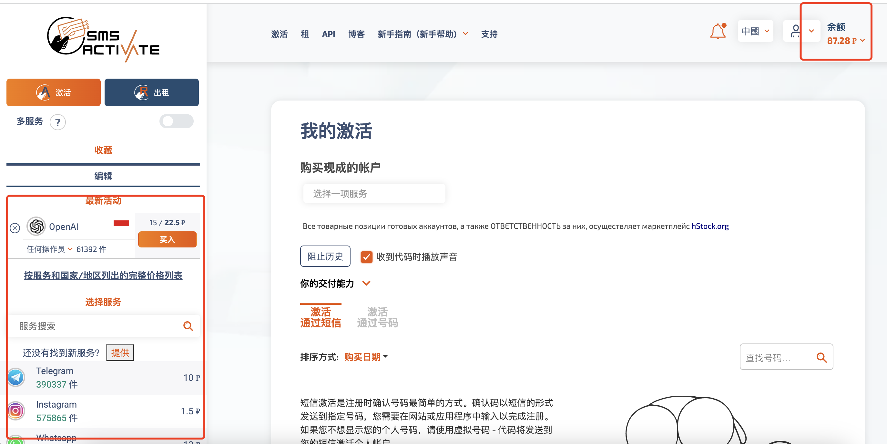

左下角就是各种`app`验证码的业务，可以直接选`OpenAI`，然后选择`印度尼西亚`(因为便宜)
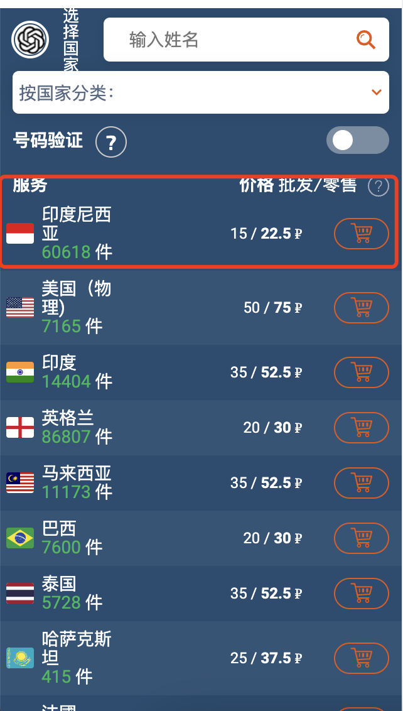

后续在注册的时候选择`Indonesia`即可(注意`sms-activate`里面是`+628`，两个是一样的)
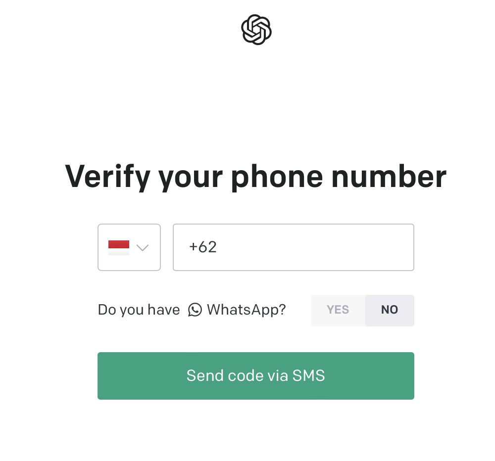

至此已经完成注册流程，现在已经可以进入`chatgpt`官网对答了。默认的是用`chatgpt3.5`模型，不过显然有更多的人希望能体验到最新的`chatgpt4.0`或者基于`openai`提供的接口搭建新服务，因此我们还需要氪金。

# 2. 海外信用卡开通
目前，无论你是`非开发者，只想在网页上体验chatgpt4.0`还是`开发者，想调用openai接口`，只要你没有海外的信用卡(实测中国香港信用卡也不行)，都没法直接体验。因为`openai`设置了付费模式，且不支持国内的银行卡。

1. 针对只想在网页上体验`chatgpt4.0`的用户
   
    `openai`提供了`plus`会员的选项，每月20刀

2. 针对开发者，`openai`提供了开放性接口
   
    文档地址: `https://platform.openai.com/docs/api-reference/introduction`
    
    注意：如果想在接口中使用`chatgpt4.0`模型，必须先开通`plus`会员，然后排队申请，排队时间不确定，目前在一些微信群里看到有人申请到了，但是数量不多，实际体验确实4快很多，效果也比3.5好。
   
    官方文档上写着前3个月提供免费5刀的额度，实测新注册的用户已经没有了
    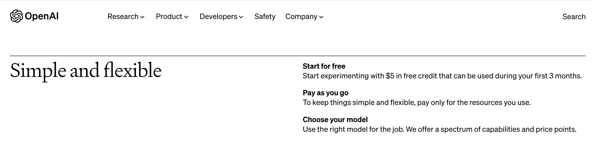
    用户中心的免费额度为0
    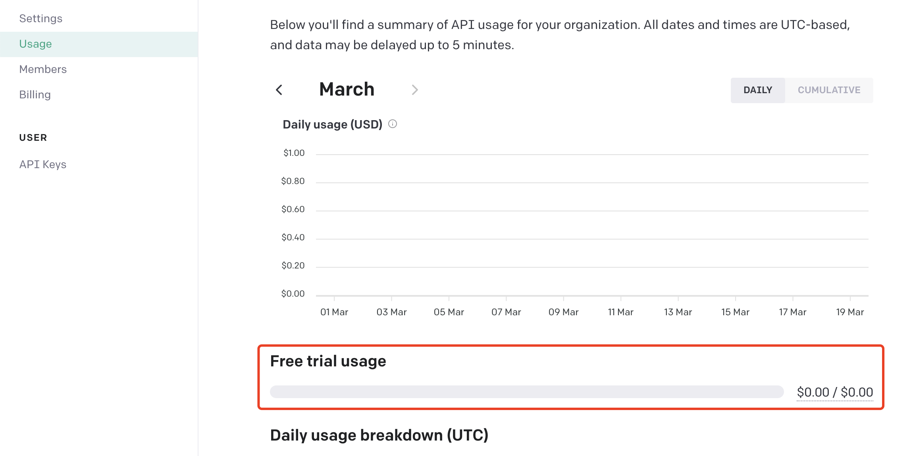

以上就是`openai`的付费模式，考虑到需要办理海外的信用卡，但是又没法肉身翻墙，只能在网上另寻野路子了。  

### 开通方式
目前主流的就是通过`depay`快速申请信用卡，然后使用虚拟货币充值激活，关于`depay`介绍`https://chatgpt-plus.github.io/depay-card/`
这里为了能快速体验`chatgpt`，不过多的纠结`depay`是啥，反正就是跟币圈相关，不要充值太多钱，不用了就注销掉。

### 开通准备
* 身份证
* 美区`Apple ID`下载
    * `Depay`软件(申请海外信用卡使用，需要身份证实名)
    * 欧易(购买虚拟货币使用，需要身份证实名，非必须，有些交流群里面有代充，额外支付点手续费即可)
    
### 开通流程
1. 使用美区的`Apple ID`下载下图软件
   
   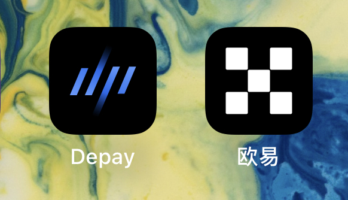
2. 打开`Depay`注册并实名验证
   
    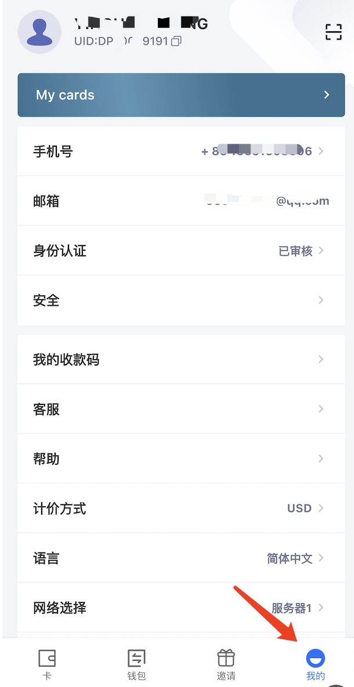
3. 可以在`Depay`的首页看到申请的信用卡(此时的卡还未激活，需要充值`USDT`)
   
    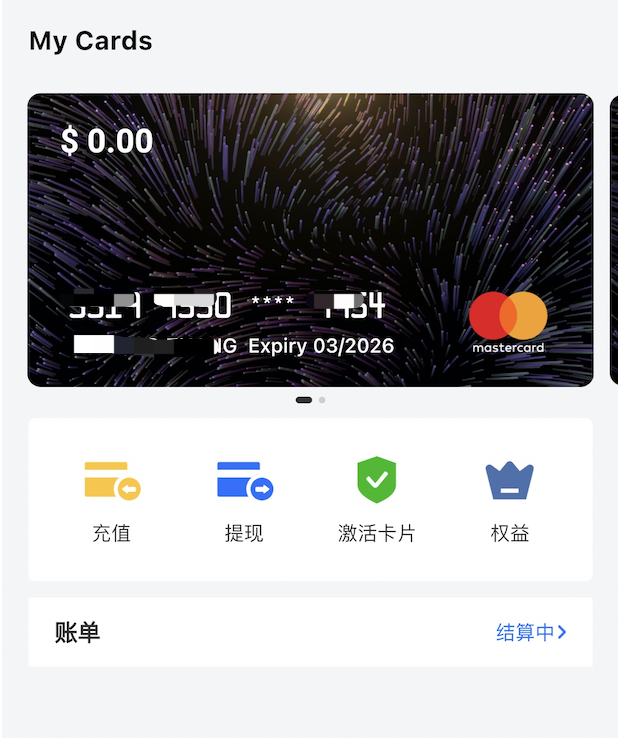
4. 充值`USDT`(币圈的加密货币，和美元价格相同)
   
    4.1 选择钱包
    
    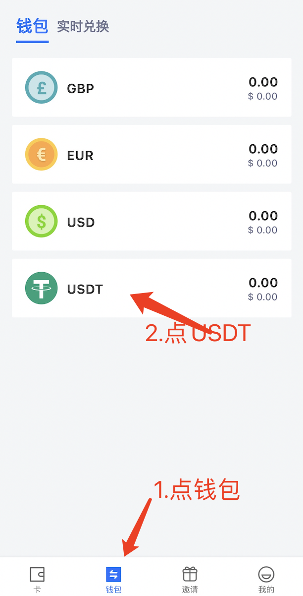
   
    4.2 选择充币
    
    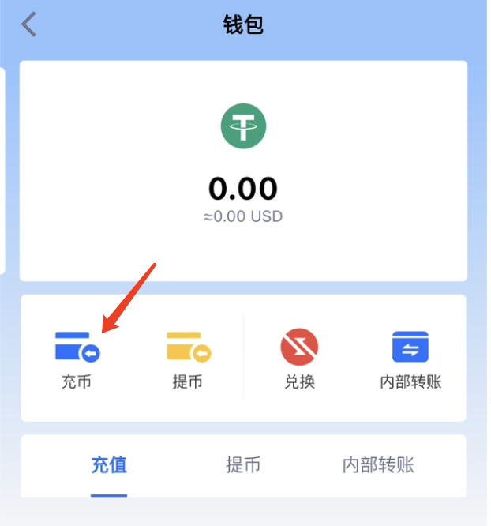
   
    4.3 选择主网`TRC20`(这玩意是啥我也不懂)
    
    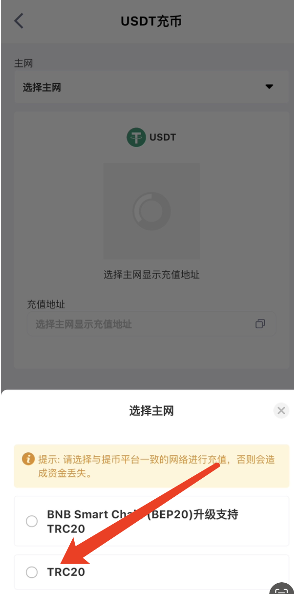
   
    4.4 复制链接(如果你觉得我写得好，也可以给我打赏一点`TVdsT8yPrSYreYYZDw67azpAT8E4eXRnbW`)
    
    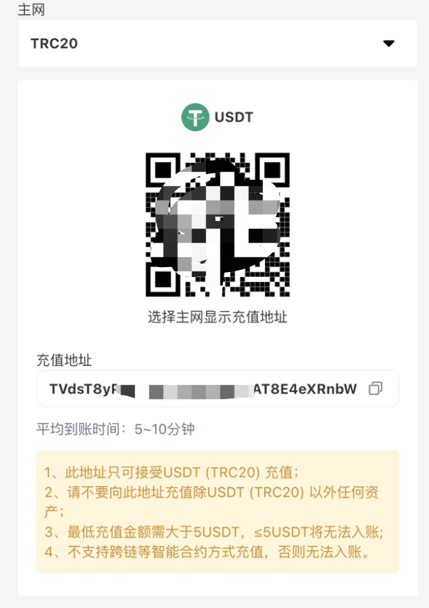
   
5. 在`欧易`中购买`USDT`，然后提币到`Depay`(也可以直接找代付的，注意不要买太多就行)
   
    5.1 购买`USDT`(📢📢📢炒币违法，这里只当学习使用，不要买卖虚拟货币)
   
    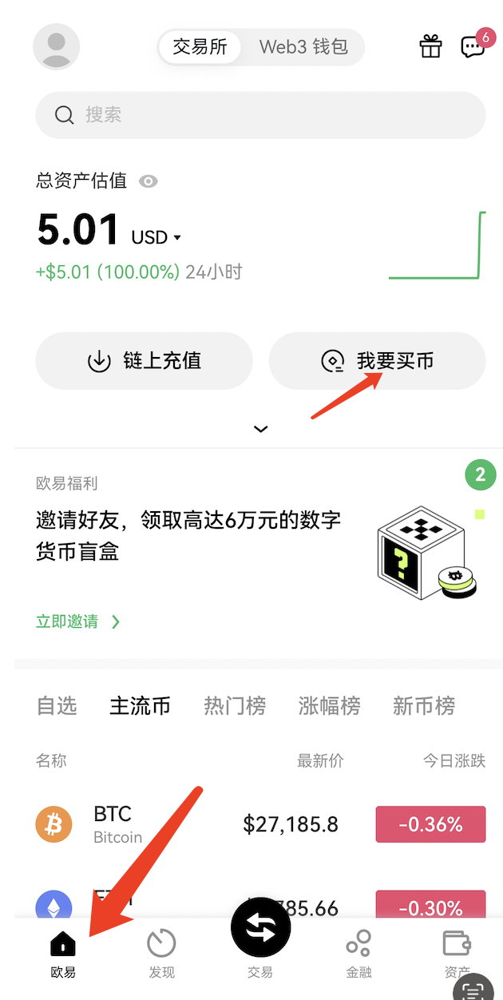
   
    5.2 选择"快捷买币"
   
    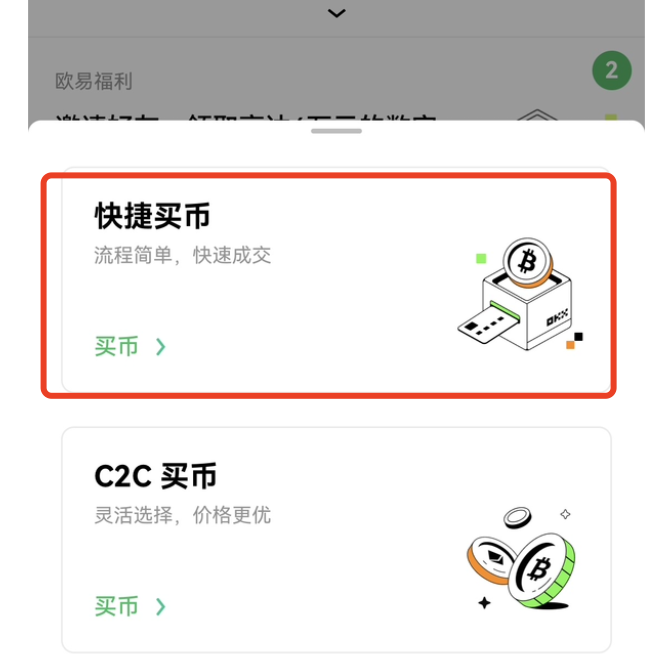
   
    5.3 选择"USDT"
   
    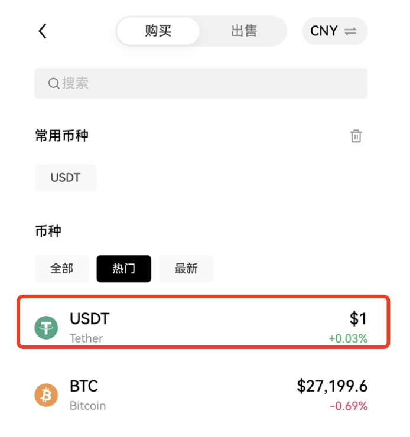
   
    5.4 填写要购买的数量，够`chatgpt`使用就行，不要买太多!!!
   
    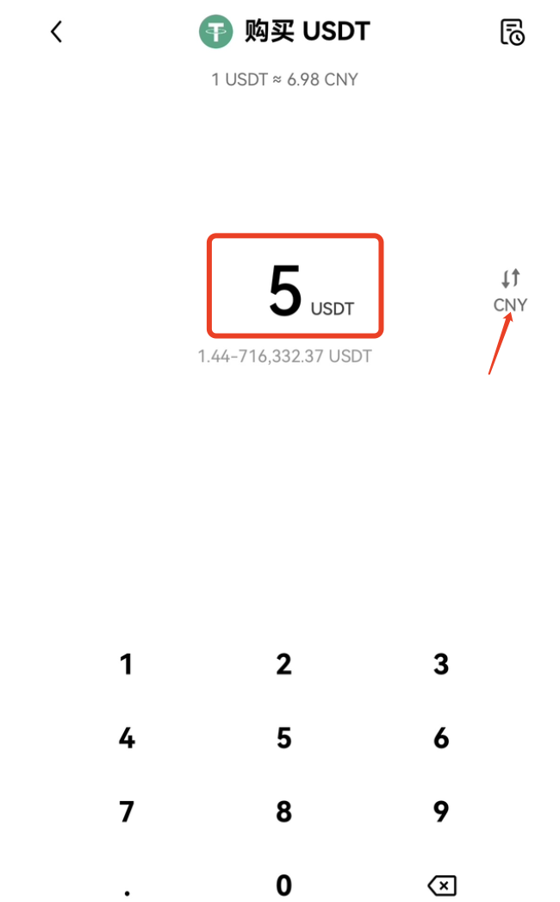
   
    5.5 使用微信或者支付宝支付(这里会有个加微信的过程，需要转账给默生人)
   
    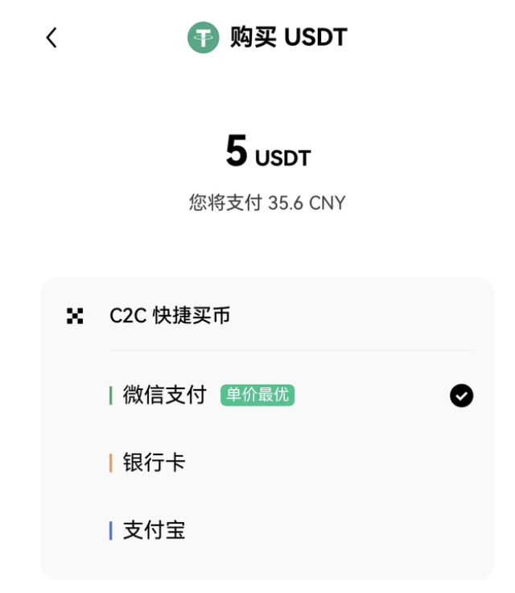
   
    5.6 充值完成之后，查看账户(提币到`Depay`需要等24小时之后)
   
    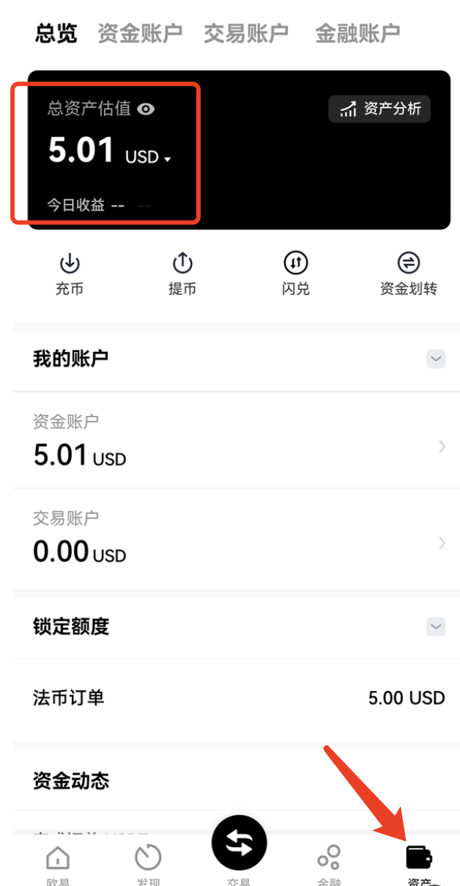
   
6. 到`Depay`中激活卡面，至此完成开户的流程
   
7. 在`openai`中绑定信用卡
   
   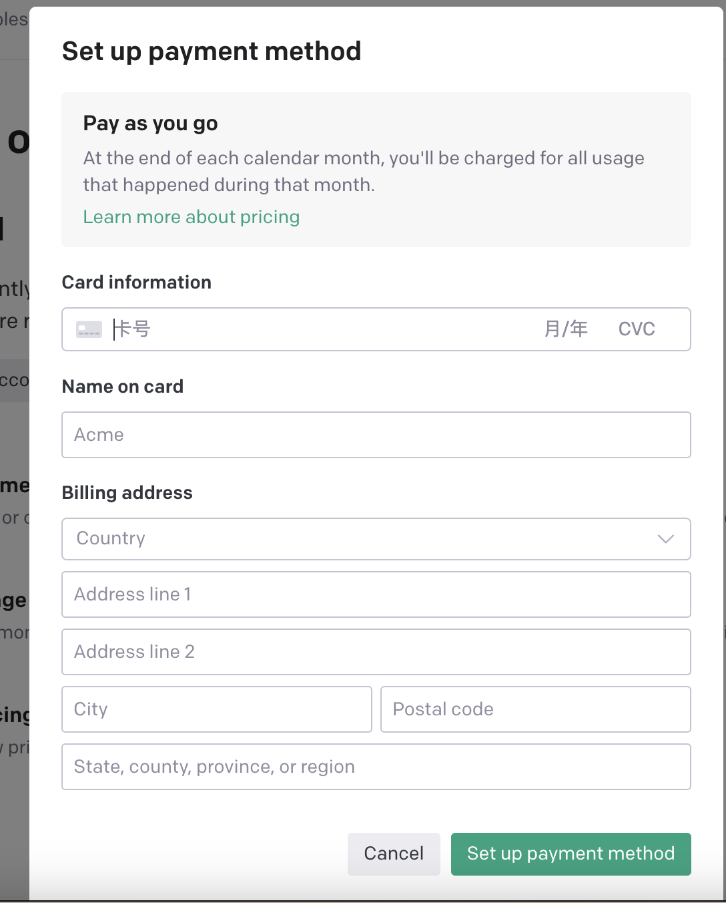
    
# 3. 调用接口
调用接口不复杂，官方里的文档有说明，`github`上搜一下也全是封装好的第三方库，这里推荐一个开源的`golang`包
* `https://github.com/sashabaranov/go-openai`

其实就是前面的充值激活信用卡之后，绑定到`openai`账号，然后拿着`token`，发起`http`调用


随便看个`demo`
```go
func SendQuestion(ctx context.Context, question string) (err error) {
	client := openai.NewClient("") // 这里使用拷贝过来的token
	resp, err := client.CreateChatCompletion(
		ctx,
		openai.ChatCompletionRequest{
			Model: openai.GPT3Dot5Turbo,  // 注意：这里只有开通了plus会员之后，申请过了才能使用4.0模型
			Messages: []openai.ChatCompletionMessage{
				{
					Role:    openai.ChatMessageRoleUser,
					Content: question,
				},
			},
		},
	)
	if err != nil {
		return
	}

	fmt.Println(resp.Choices[0].Message.Content)
	return
}
```