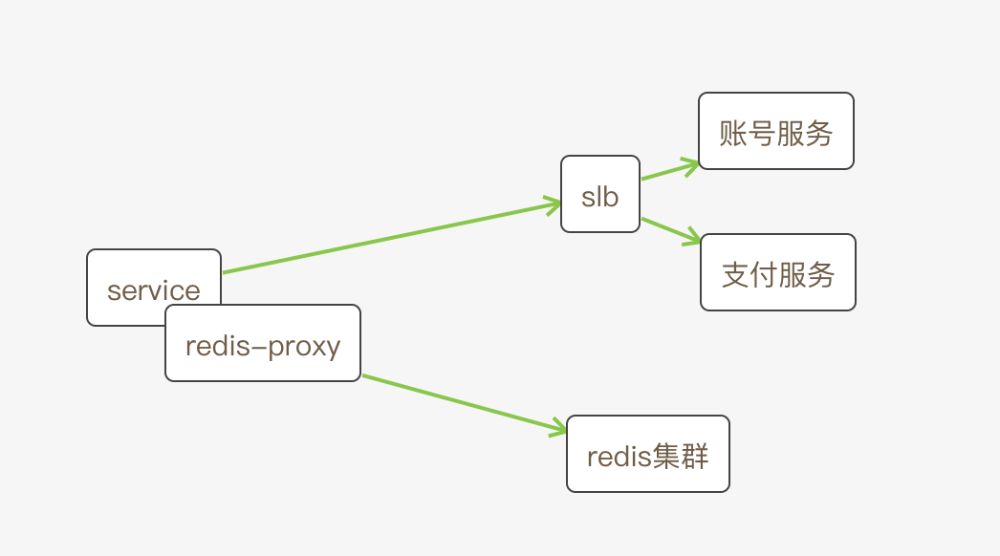
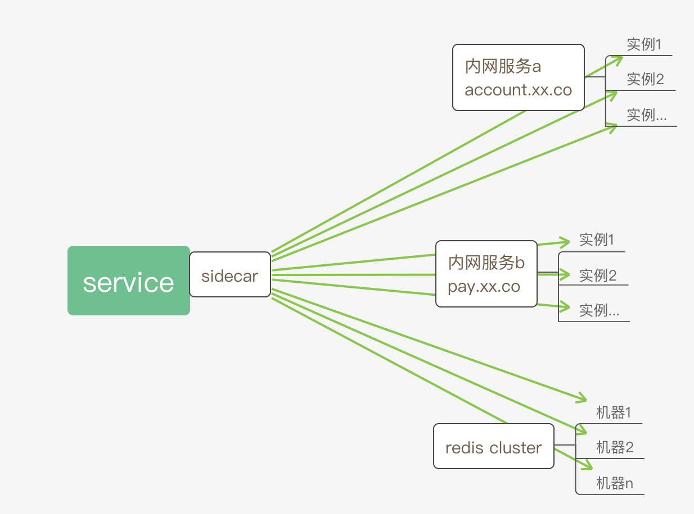

# `Envoy-Redis`源码分析 第0章

### 序

在遍地微服务的今天，`Service Mesh`蓄势待发，伺机一统江湖。恰好部门`Service Mesh`架构就是基于`Envoy`搭建的，并且高度依赖`Envoy`。而在过去的几个月，由于业务需要，正好有时间阅读了`redis proxy`相关的代码，同时发现当前网络上，关于这块的源码讲解甚少。因此决定写几篇文章，弥补此处的空白。

##### 关于`envoy`

关于`Envoy`是什么，这里基于个人理解，给个笼统的解释：就是一个超级代理，只是这个代理集成了服务发现，限流，熔断等牛逼哄哄的功能。

如果以上定义还是过于复杂，更简单的解释：代理。

既然是代理，那么必然要区分代理功能，常见的协议，`Envoy`都支持，例如`HTTP` ，`TCP`，`GRPC`协议。当然`Envoy`功能更强大，像`Redis`，`MySQL`(这两个本质也是`TCP`代理)等协议也支持。如果以上这些功能还不够，`Envoy`还可以扩展，自定义协议。

本系列文章主要讲`envoy-redis`模块源码，至于为什么要选`envoy`，`envoy`怎么使用等等，不在本文的叙述范围，后续也不会再提。

在正式开始阅读此系列文章之前，我希望您首先有以下基础：

* 对`redis`有一定的认知和使用经验，尤其是协议模块
* 对`envoy`有基础的知识，可以在`Mac/Linux`成功构建二进制文件，并且配置`redis`后端成功运行
* 对`libevent`有一定的了解，还有系统调用`select/epoll`等
* 对`c++`语法有初步的了解

##### 应用场景

开始分析源码之前，我们还需要了解一下`Envoy`使用场景。在`Service Mesh`出现之前，服务端常见的架构，如下图



我们的服务依赖2个服务，账号服务和支付服务。通常都是对应的部门/业务方提供`HTTP/GRPC`接口供我们调用。以`HTTP`接口为例(最常见方式)，我们的服务会直接调用`account.xx.co`开头的域名，然后`slb`帮我们找到对应的实例，把数据转发过去。同理，当调用支付接口时，会发起一次`url: pay.xx.co`的`HTTP`调用。这其中完整的链路会涉及到`DNS`解析，`slb`动态加载等。

如果我们的服务使用了`redis`，那么通常我们的机器还是配置一个本地代理，例如`twemproxy`。

当`Service Mesh`出现后，服务的部署情况发生了变化，见下图



可以看见这个叫`sidecar`的东西代替了`SLB`和`redis-proxy(twemproxy)`的功能。实际中这个`sidecar`叫伴生容器，配合`k8s`可以方便的部署服务。这个`sidecar`上就运行着`Envoy`二进制文件。只需要配置一下，就可以代理我们的账号和支付以及`redis`服务。

##### 使用方式

参考图中的服务依赖，我们知道`envoy`需要作为3个代理同时运行，且看`HTTP`代理配置

```yaml
static_resources: 
listeners:
- name: "http_listener"
  address: 
    socket_address: 
      address: "127.0.0.1"
      port_value: 20000
  filter_chains:
      filters: 
        - name: "envoy.http_connection_manager"
          config:
            # ...
            cluster: "service_account"
clusters:
- name: "service_account"
  hosts:
    - socket_address: 
        address: "10.20.30.40"
        port_value: 8080
    - socket_address: 
        address: "10.20.30.41"
        port_value: 8080
```

`envoy`的配置可以十分复杂，但是为了后续源码理解，所有相关配置都会选择静态的，且最直观，最简洁。从上面的`HTTP`代理配置，我们可以看出账号服务部署在2个实例上(生产环境可以有成千上百)，然后通过本地`20000`端口调用接口。这样原来我们的代码调用接口时，通过域名发起一个`HTTP`调用，类似

```shell
curl -X POST http://account.xx.co/v0/api/abc -d '{...}'
```

而现在经过`envoy`代理之后，我们代码调用则变成

```shell
curl -X POST http://127.0.0.1:20000/v0/api/abc -d '{...}'
```

同样支付服务的代理配置大概你也能猜出来了，几乎可以完全照抄，只要变动一下服务的名称即可。

你可能会疑惑这样的好处是啥，但是这不是本文要解决的问题，所以如果想要知道答案请自己去寻找。本文只谈`envoy`源码相关内容，在此之前，我们先了解`envoy`的使用方式。

同样代理`redis`时也需要一份类似的配置

```yaml
node:
  cluster: hello-service
  id: node1
static_resources:
  listeners:
    - address:
        socket_address:
          address: 127.0.0.1
          port_value: 8000
      filter_chains:
        - filters:
            - name: envoy.filters.network.redis_proxy  # well_known_names.h 中定义
              typed_config:
                "@type": type.googleapis.com/envoy.config.filter.network.redis_proxy.v2.RedisProxy # pb 中定义
                stat_prefix: redis-stat
                settings:
                  op_timeout: 3s
                  enable_redirection: true
                  max_buffer_size_before_flush: 100000
                  # enable_hashtagging: true
                  # buffer_flush_timeout
                  # max_upstream_unknown_connections
                prefix_routes:
                  routes:
                    - prefix: "a"
                      cluster: redis
                    - prefix: "b"
                      cluster: redis_1
  clusters:
    - name: redis
      connect_timeout: 0.25s
      type: strict_dns
      lb_policy: round_robin
      # # 如果这里指定了 cluster_type 参数，表明背后一个 redis cluster
      # # 如果未指定，则背后的机器都是单redis实例，只是使用简单的负载均衡lb(hash)机制
      # cluster_type:
      #     name: envoy.clusters.redis
      #     typed_config:
      #         "@type": type.googleapis.com/google.protobuf.Struct
      #         value:
      #             cluster_refresh_rate: 5s
      #             cluster_refresh_timeout: 3s
      hosts:
        - socket_address:
            address: 127.0.0.1
            port_value: 12300
      health_checks:
        timeout: 1s
        interval: 10s
        unhealthy_threshold: 9
        healthy_threshold: 0
        custom_health_check:
          name: envoy.health_checkers.redis
          typed_config:
            "@type": type.googleapis.com/envoy.config.health_checker.redis.v2.Redis
            key: foo
    - name: redis_1
      connect_timeout: 0.25s
      type: strict_dns
      lb_policy: round_robin
      hosts:
        - socket_address:
            address: 127.0.0.1
            port_value: 12200
      health_checks:
        timeout: 1s
        interval: 10s
        unhealthy_threshold: 9
        healthy_threshold: 0
        custom_health_check:
          name: envoy.health_checkers.redis
          typed_config:
            "@type": type.googleapis.com/envoy.config.health_checker.redis.v2.Redis
            key: foo
```

这份配置相对上面的`HTTP`配置可能变复杂了，不过也不难理解，我们部署了2个`redis`集群，以字符`a`开头的相关请求会发送到第一个集群`redis`(这个只是集群的名字，随爱好而定)，以字符`b`开头的请求会发送到第二个集群`redis_1`。

然后我们启动`envoy`，再通过

```shell
# redis-cli -h 127.0.0.1 -p 8000
> set a 123
> get a 
> ...
```

即可正常使用`redis`缓存。


这圈配置看下来，你会发现使用envoy也不是很难。事实也是如此，下一篇文章我会讲解`envoy`开发环境的搭建，同时运行`redis`代理。