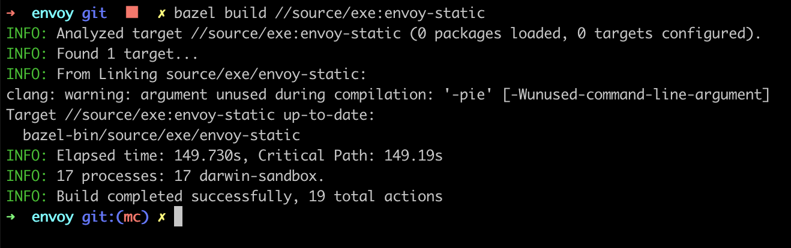
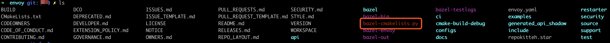
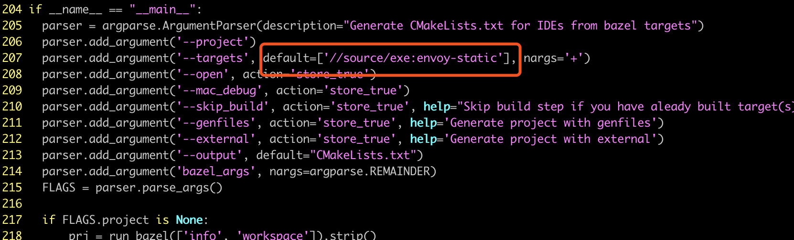
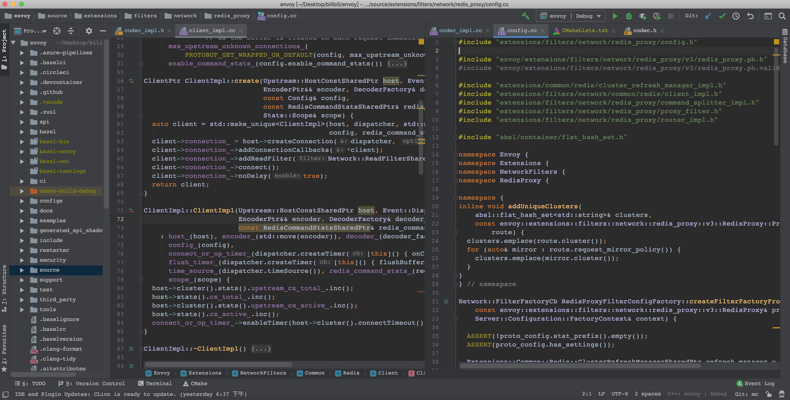
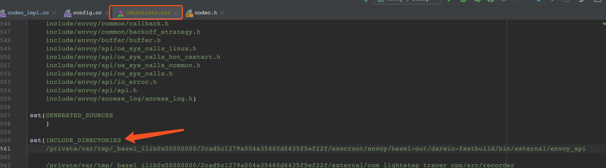
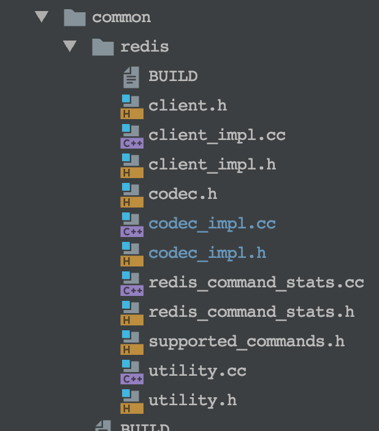
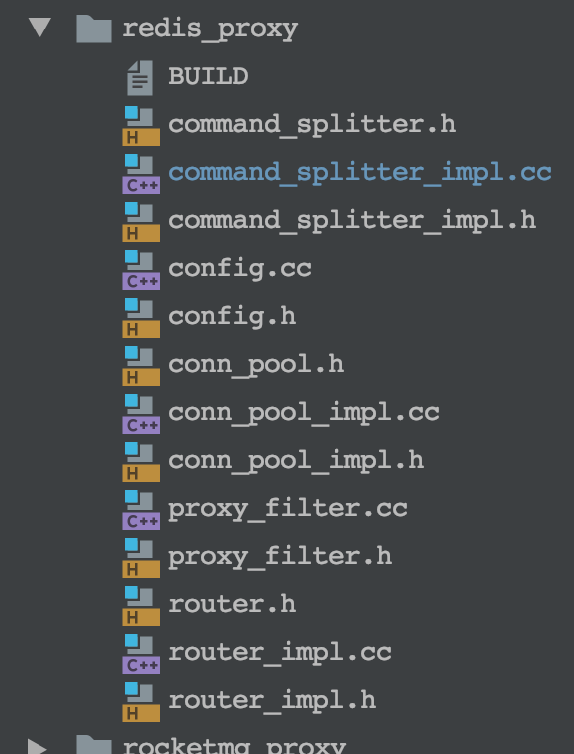
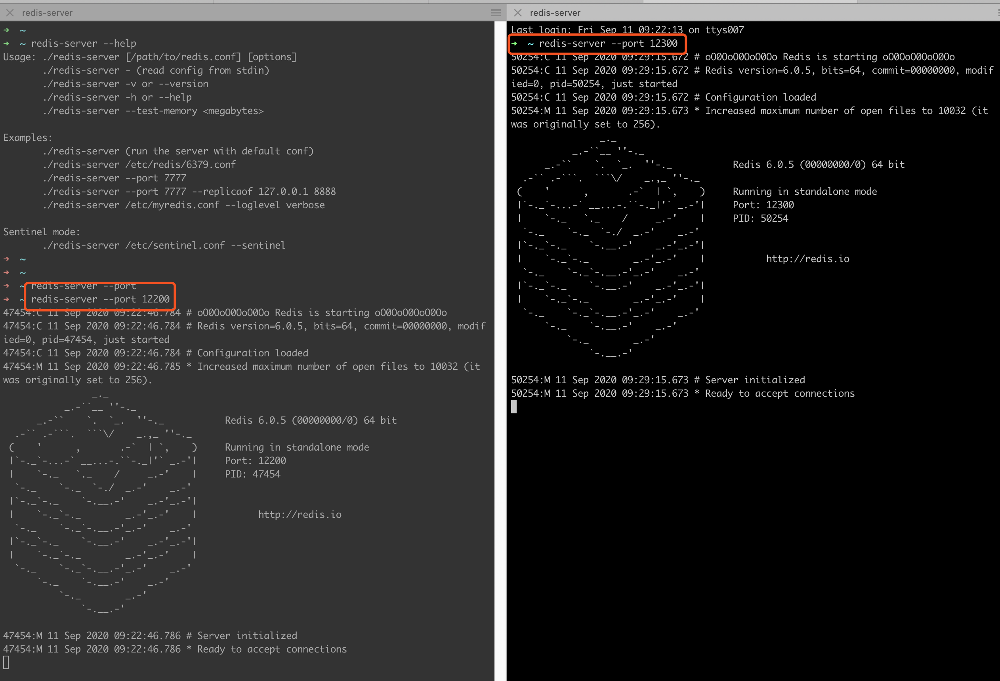
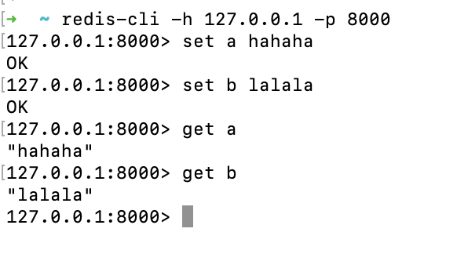

# `Envoy-Redis`源码分析 第1章

### 序    

上一篇文章我们讲解了`envoy`的应用场景和使用方式，本篇讲解开发环境的搭建。


##### 准备工作

由于`envoy`是基于`libevent`开发的，所以`envoy`的跨平台还是很方便的。本文讲解的是`mac`环境下的搭建，`Linux`下也适用，读者可自行尝试。

在此之前，需要安装以下软件，安装过程略过

* `bazel`
* `clion`

`bazel`是`envoy`官方的构建方式，但是这种方式对开发不友好，因此还需要将`bazel`工程转为`cmake`，这样可以使用`clion`打开项目，更方便阅读代码。


##### 下载源码

到`github`上下载源码

```shell
git clone https://github.com/envoyproxy/envoy.git
```

切换分支

```shell
git checkot v1.16.0
```

截止 `2020.10.20` 官方的`releases`版本到了 `v1.16.0`，`envoy`迭代速度比较快，但是代码整体组织结构变化都不大，即使是最新版本也不影响阅读。

下载之后，先进行构建

```shell
bazel build //source/exe:envoy-static
```

需要较长时间，且命令行需要能科学上网，请耐心等待。



输出以上信息表明构建成功，生成的二进制文件在`/bazel-bin/source/exe/envoy-static`。


##### 工程转化

下载工具

```shell
git clone https://github.com/lizan/bazel-cmakelists.git
```

这个工程很简单，就2个文件，一个`README.md`，一个转换的脚本`bazel-cmakelists`，将脚本拷贝到envoy项目的跟目录下，添加执行权限。



修改脚本内容，把原来的`//...`修改为`//source/exe:envoy-static`



然后执行脚本即可

```shell
python bazel-cmakelists.py
```

执行完，会生成一个`CMakeLists.txt`文件，再使用`clion`打开这个项目，如下



可以看见`clion`已经能识别各种参数，变量了，也能直接跳转，十分方便阅读。

注意生成`CMakeLists.txt`之后，项目还不算完整，`envoy`有一堆配置文件跟`pb`定义绑定着，构建的时候，会生成对应的`c++`头文件。在我的机器上，这堆文件在`/private/var/tmp/_bazel_ilib0x00000000/2cad5c1279a004a35460d6435f5ef22f/execroot/envoy/bazel-out/darwin-fastbuild/bin/external/envoy_api`目录下，不同的机器可能路径不同，读者可以尝试自己去寻找，找到之后把这个路径加到`CMakeLists.txt`的头文件寻找路径中。



至此，我们已经能使用`clion`加载这个项目了。


##### 代码组织

与redis相关的代码主要在

`/envoy/source/extensions/filters/network/common/redis`



`/envoy/source/extensions/filters/network/redis_proxy`



由于`envoy`使用的线程模型比较复杂，因此我们不在`IDE`中`debug`代码，也不在`IDE`中启动项目，后续的构建还是使用`bazel`的方式，同时使用`print`大法调试，`IDE`只用来看代码。

至此环境搭建，已经完毕，接下来演示一下代理`redis`请求。


##### 运行`Envoy`

最后我们配置一下redis代理，启动envoy。首先在本地安装`redis-server`，然后启动2个独立进程，如下图



分别在端口`12200`和`12300`启动`redis server`，然后继续配置`envoy`，配置文件如下

```yaml
admin:
  access_log_path: /dev/stdout
  address:
    socket_address:
      address: 0.0.0.0
      port_value: 8081

node:
  cluster: hello-service
  id: node1

static_resources:
  listeners:
    - address:
        socket_address:
          address: 127.0.0.1
          port_value: 8000
      filter_chains:
        - filters:
            - name: envoy.filters.network.redis_proxy  # well_known_names.h 中定义
              typed_config:
                "@type": type.googleapis.com/envoy.config.filter.network.redis_proxy.v2.RedisProxy # pb 中定义
                stat_prefix: redis-stat
                settings:
                  op_timeout: 3s
                  enable_redirection: true
                  max_buffer_size_before_flush: 100000
                  # enable_hashtagging: true
                  # buffer_flush_timeout
                  # max_upstream_unknown_connections
                prefix_routes:
                  routes:
                    - prefix: "a"
                      cluster: redis
                    - prefix: "b"
                      cluster: redis_1
  clusters:
    - name: redis
      connect_timeout: 0.25s
      type: strict_dns
      lb_policy: round_robin
      # # 如果这里指定了 cluster_type 参数，表明背后一个 redis cluster
      # # 如果未指定，则背后的机器都是单redis实例，只是使用简单的负载均衡lb(hash)机制
      # cluster_type:
      #     name: envoy.clusters.redis
      #     typed_config:
      #         "@type": type.googleapis.com/google.protobuf.Struct
      #         value:
      #             cluster_refresh_rate: 5s
      #             cluster_refresh_timeout: 3s
      hosts:
        - socket_address:
            address: 127.0.0.1
            port_value: 12300
      health_checks:
        timeout: 1s
        interval: 10s
        unhealthy_threshold: 9
        healthy_threshold: 0
        custom_health_check:
          name: envoy.health_checkers.redis
          typed_config:
            "@type": type.googleapis.com/envoy.config.health_checker.redis.v2.Redis
            key: foo
    - name: redis_1
      connect_timeout: 0.25s
      type: strict_dns
      lb_policy: round_robin
      hosts:
        - socket_address:
            address: 127.0.0.1
            port_value: 12200
      health_checks:
        timeout: 1s
        interval: 10s
        unhealthy_threshold: 9
        healthy_threshold: 0
        custom_health_check:
          name: envoy.health_checkers.redis
          typed_config:
            "@type": type.googleapis.com/envoy.config.health_checker.redis.v2.Redis
            key: foo
```

可以看见配置了2个`redis`集群，虽然每个集群只有1台实例，更多实例和集群读者可自行尝试配置，方法类似。

万事俱备，最后启动`envoy`

```shell
./bazel-bin/source/exe/envoy-static -c envoy.yaml -l debug
```

最后的最后，让我们来验证一下`envoy`的可用性



在终端连上代理端口，可以正常的设置和读取缓存。

至此开发环境搭建和运行代理实例讲解完毕，下一篇开始源码之旅。不过在这，我还想留两个问题交给读者思考

1. 在我们的配置文件中，我们给以不同`prefix`的`key`指定了不同的`redis`集群，那么没有指定`prefix`的`key`会怎么办？
2. 如果`redis`集群中不止一个实例，这些`key`最终会存储到哪台机器？


##### 待续

在阅读下一篇文章之前推荐读者再阅读几篇文章

* [剖析Envoy Filter的Bazel编译配置](https://mp.weixin.qq.com/s/a9OgOKHDaG3ZOEQGU0e-bA)
* [envoy filter 开发实践系列 1：官网 echo 示例编译测试](https://mp.weixin.qq.com/s/lWTbKYr7VW_m40ntdwFOvg)
* [envoy filter 开发实践系列 2：官网 http filter 示例编译测试](https://mp.weixin.qq.com/s/FwUt2XcLoaMz5xRm90K9yw)
* [envoy filter 开发实践系列 3：编译 envoy 的其它方式](https://mp.weixin.qq.com/s/OH-cbC0SiCPTIXWgowesLA)

