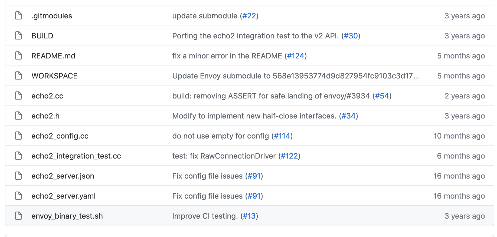

# `Envoy-Redis`源码分析 第2章

### 序

本来这章应该直接贴`redis`模块源码，然后一顿战术分析。但是考虑到`envoy`对新手不太友好，因此还是再补充点相关知识。


##### `协议`

`envoy`根据代理的协议把过滤器分为2种

`L4`: `TCP proxy`

`L7`: `HTTP proxy`

而实现这些代理的功能就是靠`filter`实现的，`L4`是`TCP filter`，`L7`是`HTTP filter`。当然有的`filter`很常用，`envoy`已经帮我们写好了，例如`HTTP`相关的，`redis`，`MySQL`之类的。当我们要扩展`envoy`时，支持自定义协议时，实际上就是去添加这些`filter`。

如果我们使用的是`tcp`协议，就需要实现`tcp filter proxy`。实现也不复杂，先声明一个`FilterProxy class`，这个`class`实现了指定的方法，然后把`class`注册到`envoy`中。这样我们启动`envoy`时，通过配置文件中声明的`listener`，就可以接管下游的流量。


##### `filter`

L4过滤器的接口非常简单，只有4个方法

```c++
class ReadFilter {
public:
  	// 当下游连接有数据过来时调用
  	virtual FilterStatus onData(Buffer::Instance& data, bool end_stream) PURE;
  
  	// 当下游有新的连接事件时调用
  	virtual FilterStatus onNewConnection() PURE;
  	
  	// 初始化用于和过滤器管理器交互的读过滤器回调
  	// 过滤器被注册时，将被过滤器管理器调用一次，
  	// 任何需要用到底层连接的构造，需要在此函数的回调中执行
  	virtual void initializeReadFilterCallbacks(ReadFilterCallbacks& callbacks) PURE;
};

class WriteFilter {
public:
  	// 当在此连接上发生数据写入时调用
  	virtual FilterStatus onWrite(Buffer::Instance& data, bool end_stream) PURE;
};

class Filter: public ReadFilter, public WriteFilter {};
```

每个`filter`都要实现以上的方法，然后根据配置和代码的规则依次去回调对应的方法，从而构成完整的代理链路。

`envoy`收到客户端的请求时，可以通过一些列`filter func`，这些函数各有各的功能，如果不符合预期，还可以将请求拦截，不再往下透传。

熟悉`select/epoll`编程的人大概一眼就看明白了。


##### `自定义filter`

官方给了两个自定义`filter`的示例，其中一个就是`tcp filter`，项目地址:`https://github.com/envoyproxy/envoy-filter-example`，核心文件如下图展示



这个`filter`实现功能很简单，收到客户端的数据，打印一条日志，然后将数据原封不动的返回回去。下面我们挨个文件分析。

1. 查看配置文件，如何配置tcp代理

   ```yaml
   # 官方给的配置文件有点问题，需要读者替换一些端口，envoy才能正常运行
   # 这里配置一个管理后台，用户在浏览器输入 http://127.0.0.1:8080/ 可以看到envoy的一些内部信息
   admin:
     access_log_path: /dev/null
     address:
       socket_address:
         address: 127.0.0.1
         port_value: 8080
         
   static_resources:
     clusters:
     	# 这里本该配置一些服务端实例，但是由于这个proxy在filter中直接把数据回吐出去了，不需要转发给上游机器
     	# 因此这里的 clusters 其实没必要配置
       name: cluster_0
       connect_timeout: 0.25s
       load_assignment:
         cluster_name: cluster_0
         endpoints:
           - lb_endpoints:
               - endpoint:
                   address:
                     socket_address:
                       address: 127.0.0.1
                       port_value: 0
     listeners:
     	# 这里就是配置tcp代理
     	# 代理端口 12345
     	# proxy在这个端口接收下游数据，收到数据之后，会依次寻找 filter，这里只有1个filter叫 echo2
       name: listener_0
       address:
         socket_address:
           address: 127.0.0.1
           port_value: 12345
       filter_chains:
       - filters:
         - name: echo2
           config:
   ```

   

2. 如何注册`filter`

   在上面的配置文件，我们看到`envoy`监听着`12345`端口，并且收到数据之后，会找一个叫`echo2`的`filter`，告诉他收到下游的数据，你来处理一下。那么`envoy`是怎么找到我们添加的`filter`呢？我们接着看`echo2_config.cc`文件

   ```c++
   /**
    * Config registration for the echo2 filter. @see NamedNetworkFilterConfigFactory.
    */
   class Echo2ConfigFactory : public NamedNetworkFilterConfigFactory {
   public:
     Network::FilterFactoryCb createFilterFactoryFromProto(const Protobuf::Message&,
                                                           FactoryContext&) override {
       return [](Network::FilterManager& filter_manager) -> void {
         filter_manager.addReadFilter(Network::ReadFilterSharedPtr{new Filter::Echo2()});
       };
     }
   
     ProtobufTypes::MessagePtr createEmptyConfigProto() override {
       return ProtobufTypes::MessagePtr{new Envoy::ProtobufWkt::Struct()};
     }
   	
     // filter 的名字叫 echo2
     std::string name() const override { return "echo2"; }
   
     bool isTerminalFilter() override { return true; }
   };
   
   /**
    * Static registration for the echo2 filter. @see RegisterFactory.
    * 这里就是在向envoy注册一个filter
    */
   static Registry::RegisterFactory<Echo2ConfigFactory, NamedNetworkFilterConfigFactory> registered_;
   ```
   
根据上面的代码，加上猜测可以知道，配置中指定了一个代理端口，这个端口上收到的数据，会交给`echo2`这个`filter`处理，然后我们在代码中注册了一个`filter:Filter::Echo2`，这`filter`的名字就叫`echo2`。事实也确实如此。
   

   
3. `filter`如何实现功能

   我们看见在上面的文件里，已经注册了一个`filter`，而根据之前说的每个`filter`会实现几个方法供`envoy`回调，我们再接着看回调的逻辑

   ```c++
   #pragma once
   
   #include "envoy/network/filter.h"
   
   #include "common/common/logger.h"
   
   namespace Envoy {
   namespace Filter {
   
   /**
    * Implementation of a basic echo filter.
    */
   class Echo2 : public Network::ReadFilter, Logger::Loggable<Logger::Id::filter> {
   public:
     // Network::ReadFilter
     Network::FilterStatus onData(Buffer::Instance& data, bool end_stream) override;
     // 收到下游的连接请求，这里表示放行，即允许建立连接
     Network::FilterStatus onNewConnection() override { return Network::FilterStatus::Continue; }
     void initializeReadFilterCallbacks(Network::ReadFilterCallbacks& callbacks) override {
       read_callbacks_ = &callbacks;
     }
   
   private:
     Network::ReadFilterCallbacks* read_callbacks_{};
   };
   
   } // namespace Filter
   } // namespace Envoy
   ```

   ```c++
   #include "echo2.h"
   
   #include "envoy/buffer/buffer.h"
   #include "envoy/network/connection.h"
   
   #include "common/common/assert.h"
   
   namespace Envoy {
   namespace Filter {
   
   /*
    * envoy 收到下游的数据之后会回调这个方法
    */  
   Network::FilterStatus Echo2::onData(Buffer::Instance& data, bool) {
     // 打印日志
     ENVOY_CONN_LOG(trace, "echo: got {} bytes", read_callbacks_->connection(), data.length());
     // 把收到的数据回写
     read_callbacks_->connection().write(data, false);
     // 不再往下执行
     // 意思是有多个filter的话，收到的数据不用再传给后面filter处理
     return Network::FilterStatus::StopIteration;
   }
   
   } // namespace Filter
   } // namespace Envoy
   ```

   

4. 构建

   将我们的`filter`代码集成到`envoy`中，这是`bazel`项目的构建方式

   ```shell
   bazel build //:envoy
   ```


如上，这是一个简单自定义`filter`的过程，如果还有更复杂的协议，只需要在`onData()`函数中做对应的逻辑即可。


##### 思考

上面的示例，没有添加真正的处理服务机器，如果需要将请求转发给上游，代码该如何写？

