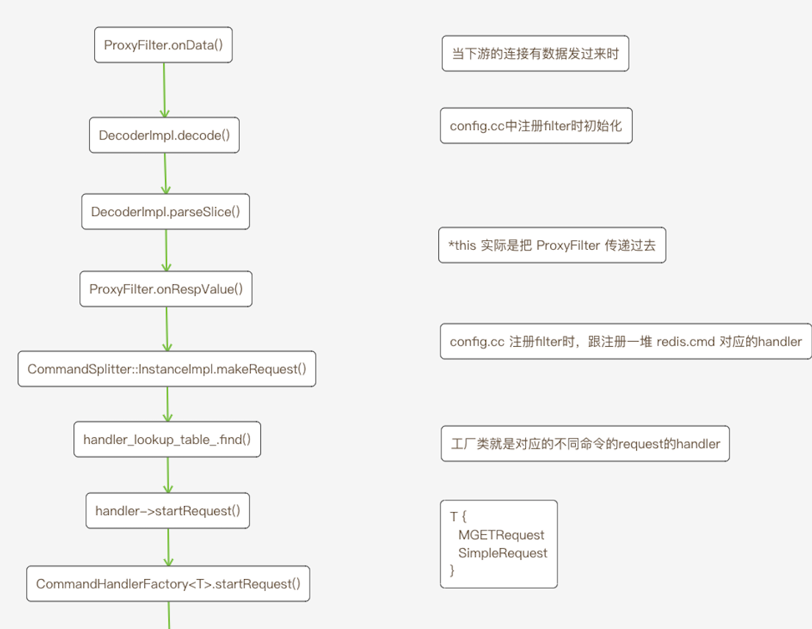

# `Envoy-Redis`源码分析 第3章

### 序

本文正式开始讲解`redis`源码，源码涉及很多`c++`和`redis`协议的知识，加上源码中有很多混淆的地方，例如在形参中叫`request`，但是在实参中却叫`callback`，诸如此类，比较晦涩难懂。


`envoy`代理`redis`的整体流程是定制一个`filter`，当下游的连接上有数据发送过来时，在回调中(`onData`)处理`request`的解码，然后根据不同命令找到对应的`handler`，从上游`cluster`中对应的池子中取一个连接，再把请求`encode`发到上游。这里的`filter`与前面说的`tcp filter`行为是一致的，只不过前面的`tcp filter`像是一个外挂，`redis filter`被直接集成进了`envoy`。

定制`filter`配置

```yaml
"@type": type.googleapis.com/envoy.config.filter.network.redis_proxy.v2.RedisProxy
```

从前面的`tcp filter`我们知道，要实现一个`filter`就是创建一个类，这个类实现几个指定的方法，然后把这个类注册到`envoy`中，`redis filter`也是这样的，具体对应的源码

```c++
// envoy/source/extensions/filters/network/redis_proxy/config.cc 
return [splitter, filter_config](Network::FilterManager& filter_manager) -> void {
    Common::Redis::DecoderFactoryImpl factory;
    filter_manager.addReadFilter(
        std::make_shared<ProxyFilter>(
            factory,
            Common::Redis::EncoderPtr{new Common::Redis::EncoderImpl()},
            *splitter,
            filter_config
        )
    );
};

// 注册的地方，大家可以自己尝试去寻找一下
// 没前面的 tcp filter 简单直白，但是也不复杂
```

如前一篇文章所说，这里的`ProxyFilter`就是`tcp filter`，后续的故事都要从这个`ProxyFilter`说起，先看看初始化的参数，我们后面会展开说明。

* `factory`
* `Common::Redis::EncoderPtr{new Common::Redis::EncoderImpl()}`
* `splitter`
* `filter_config`

当接收到下游的数据时，我们已经知道会回调`filter`的`onData()`方法，如下

```c++
// envoy/source/extensions/filters/network/redis_proxy/proxy_filter.cc
// ProxyFilter.onData()的逻辑很简单，就是一行调用
try {
    decoder_->decode(data);
}
```

我们来看看这个`decoder_`是啥

```c++
// envoy/source/extensions/filters/network/redis_proxy/proxy_filter.cc
// ProxyFilter 的构造函数
ProxyFilter::ProxyFilter(Common::Redis::DecoderFactory& factory,
                         Common::Redis::EncoderPtr&& encoder, CommandSplitter::Instance& splitter,
                         ProxyFilterConfigSharedPtr config):
        decoder_(factory.create(*this)),
        encoder_(std::move(encoder)),
        splitter_(splitter),
        config_(config) {
// 这里的 factory 就是上面4个参数之一
// 注意这里在创建 decoder_ 时把自己(ProxyFilter)传了进去
}
```

再接着看生成 `decoder_` 的工厂函数`factory.create`

```c++
// source/extensions/filters/network/common/redis/codec_impl.h
 
class DecoderFactoryImpl : public DecoderFactory {
public:
  // RedisProxy::DecoderFactory
  DecoderPtr create(DecoderCallbacks& callbacks) override {
    return DecoderPtr{new DecoderImpl(callbacks)};
  }
};
```

可以看到实际是创建一个 `DecoderImpl` 对象，并且`ProxyFilter` 作为`callbacks`【这里后面有用到】

所以当下游连接有数据发来时，调用链就变成了`ProxyFilter.onData() --> decoder_.decode(data) --->  DecoderImpl::decode(data)`

```c++
// source/extensions/filters/network/common/redis/codec_impl.cc
 
void DecoderImpl::decode(Buffer::Instance& data) {
  for (const Buffer::RawSlice& slice : data.getRawSlices()) {
    parseSlice(slice);
  }
 
  data.drain(data.length());
}
 
void DecoderImpl::parseSlice(const Buffer::RawSlice& slice) {
    // 这里的代码就是在解析 redis 协议，代码比较多，不展开
    // 当解析完redis协议，会回调 callbacks_.onRespValue() 方法
    // ...
    if (pending_value_stack_.empty()) {
        callbacks_.onRespValue(std::move(pending_value_root_));
        state_ = State::ValueRootStart;
      }
    // ...
}
```

还记得上面说到，创建`DecoderImpl` 时会把`ProxyFilter`作为`callbacks`塞到`decoder`对象里，所以这里又变成调用`ProxyFilter::onRespValue()`

```c++
// envoy/source/extensions/filters/network/redis_proxy/proxy_filter.cc
void ProxyFilter::onRespValue(Common::Redis::RespValuePtr&& value) {
  pending_requests_.emplace_back(*this);
  PendingRequest& request = pending_requests_.back();
  CommandSplitter::SplitRequestPtr split = splitter_.makeRequest(std::move(value), request);
}
```

这里出现了2个对象

* `PendingRequest`
* `splitter_`

`splitter`是在`config.cc`中初始化`ProxyFilter`4个参数之一，具体可以回到前面的代码中看，下面直接看`splitter_.makeRequest`代码，

```c++
// splitter_ 初始化在 envoy/source/extensions/filters/network/redis_proxy/config.cc 中
SplitRequestPtr InstanceImpl::makeRequest(Common::Redis::RespValuePtr&& request, SplitCallbacks& callbacks) {
  // 检验解析后request是否合法
  if ((request->type() != Common::Redis::RespType::Array) || request->asArray().empty()) {
    onInvalidRequest(callbacks);
    return nullptr;
  }
 
  for (const Common::Redis::RespValue& value : request->asArray()) {
    if (value.type() != Common::Redis::RespType::BulkString) {
      onInvalidRequest(callbacks);
      return nullptr;
    }
  }
 
  std::string to_lower_string = absl::AsciiStrToLower(request->asArray()[0].asString());
 
  if (to_lower_string == Common::Redis::SupportedCommands::auth()) {
    // auth 指令
    return nullptr;
  }
 
  if (!callbacks.connectionAllowed()) {
    callbacks.onResponse(Common::Redis::Utility::makeError(Response::get().AuthRequiredError));
    return nullptr;
  }
 
  if (to_lower_string == Common::Redis::SupportedCommands::ping()) {
    // ping 指令
    return nullptr;
  }
 
  if (request->asArray().size() < 2) {
    // ...
    return nullptr;
  }
 
  auto handler = handler_lookup_table_.find(to_lower_string.c_str());
  // ...
  handler->command_stats_.total_.inc();
  SplitRequestPtr request_ptr = handler->handler_.get().startRequest(
      std::move(request), callbacks, handler->command_stats_, time_source_);
  return request_ptr;
}
```

当`redis`协议解析完成，`request`会变成一个`RespValue`对象，对于`redis`请求，一般都是一个列表，例如

`redis`请求命令： `get test`，实际发出去的字节格式如下

```shell
*2\r\n$3\r\nget\r\n$4\r\ntest\r\n
```

解析完之后，变成对象`RespValue{std::vector{"get", "test"}} // RespValue` 里面是一个数组，每个数组元素是一个 `BulkString`

然后判断请求是否合理，例如数组不能为空。再判断请求是不是特殊的命令如`ping`和`auth`。最后在提前准备好的 `handler map`找到对应的`handler`来处理请求。

这个`handler map`是在初始化的时候，创建的

```c++
// source/extensions/filters/network/redis_proxy/command_splitter_impl.cc
// InstanceImpl 构造函数
  for (const std::string& command : Common::Redis::SupportedCommands::simpleCommands()) {
    addHandler(scope, stat_prefix, command, latency_in_micros, simple_command_handler_);
  }
 
  for (const std::string& command : Common::Redis::SupportedCommands::evalCommands()) {
    addHandler(scope, stat_prefix, command, latency_in_micros, eval_command_handler_);
  }
 
  for (const std::string& command : Common::Redis::SupportedCommands::hashMultipleSumResultCommands()) {
    addHandler(scope, stat_prefix, command, latency_in_micros, split_keys_sum_result_handler_);
  }
 
  addHandler(scope, stat_prefix, Common::Redis::SupportedCommands::mget(), latency_in_micros, mget_handler_);
  addHandler(scope, stat_prefix, Common::Redis::SupportedCommands::mset(), latency_in_micros, mset_handler_);
```

其实就是不同的指令有不同的处理函数，例如

`get --->simple_command_handler_`

`mget--->mget_handler_`

至此可以看见了以上的代码解决的问题

1. `decode redis request`
2. 校验`request`的合法性和处理特殊的`request`
3. 普通的`request`找到对应的`handler`，交由`handler`再做具体处理。

因此用一张图总结上面的流程




最后总结一下今天的文章：

`redis`处理的流程比较复杂，但是框架很简单，无非3步

1. 接收下游的数据，解析`redis`协议，每种命令都会对应一个`handler`
2. 管理上游的`cluster`，`handler`会根据`key`找到上游对应的机器，把请求转发过去
3. 接收上游的响应，把结果转给下游

今天只讲了第1步，但是由于`c++`代码的复杂性，以及`envoy-redis`的设计【吐槽一下`request/callback`不停的转换】，导致代码比较难读。


##### 思考

1. `ProxyFilter.onRespValue()` 中的 `pending_request` 是啥?
2. `command_splitter_impl.cc  InstanceImpl::makeRequest()` 中的 `callbacks`又是啥？
