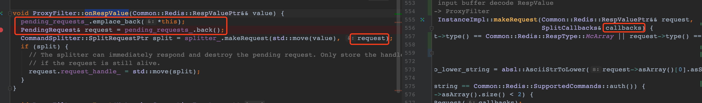
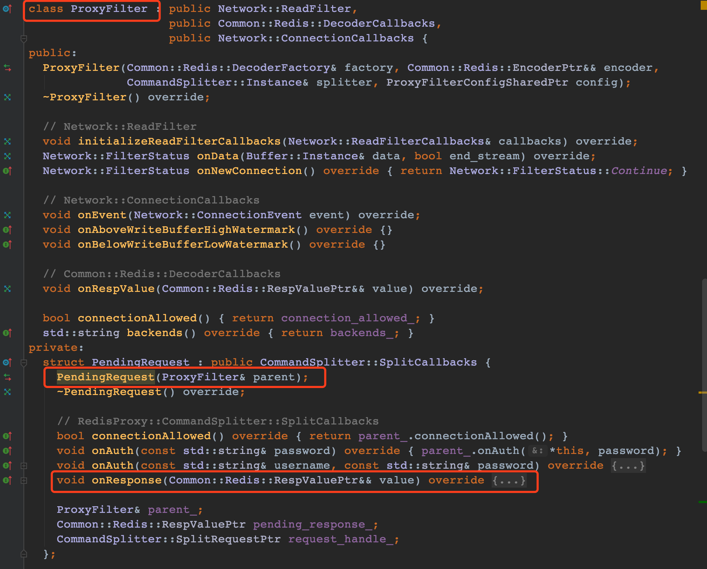
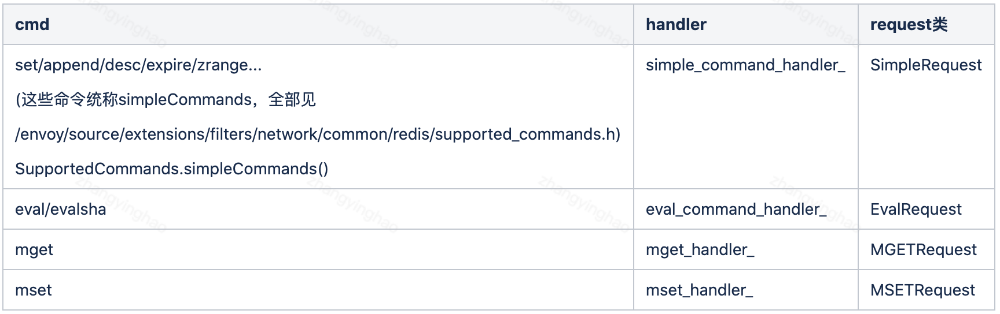
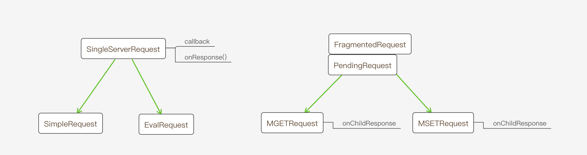
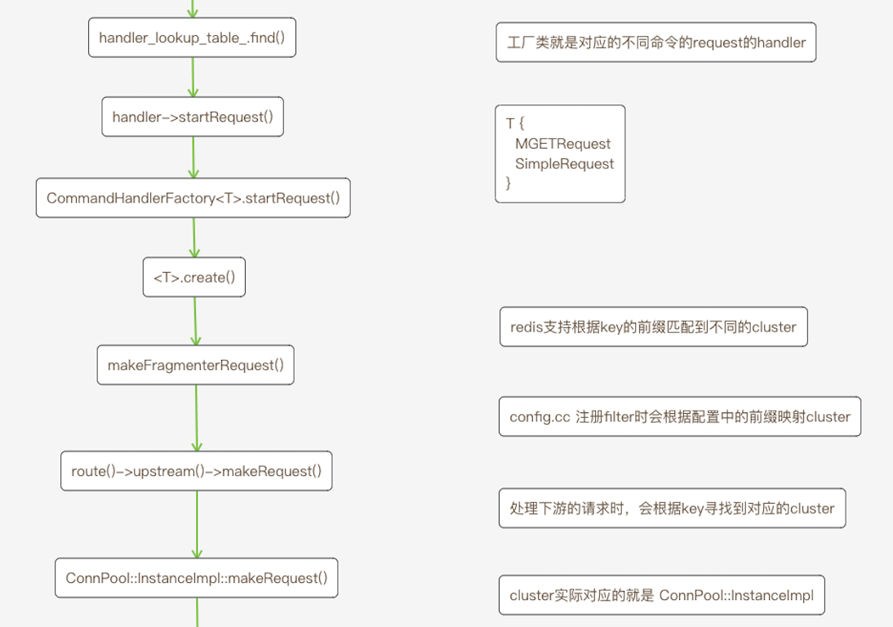

# `Envoy-Redis`源码分析 第4章

### 序

书接上回，我们分析了`envoy`是如何解析`redis`协议，生成`RespValue`对象，然后再根据`cmd`去找对应的`handler`。本文接着说`handler`的行为。


先回答上一章最后留的问题

1. `pending_request`是`ProxyFilter::PendingRequest`对象
2. `InstanceImpl::makeRequest`中的`callbacks`就是`pending_request`



如图：`PendingRequest`对象构造函数，需要一个`ProxyFilter`对象，这里也确实通过`this`构造了一个`PendingRequest`对象传进`pending_requests_`了，然后再取出取出这个对象（为什么要这样干，读者可以先自己思考一下），然后调用`splitter_.makeRequest()`，就这样`request`悄悄的变成了`callback`对象。

此外，我们看一下`PendingRequest`类



划一下重点，`PendingRequest`对象实现了`onResponse()`方法，注意这点很重要！！！


上一章我们说到，解析完命令之后，根据 命令查找到对应的`handler`，然后调用`handler`的`startRequest()`方法。其实这也很好理解，`envoy`启动的时候，提前把`cmd(string)`和`handler(template <class RequestClass>)`加载进一个`map`，当把`redis`请求解析成`request`对象时，可以拿到请求的`cmd`，再去`map`中查找`handler`。

```c++
// source/extensions/filters/network/redis_proxy/command_splitter_impl.cc
 
auto handler = handler_lookup_table_.find(to_lower_string.c_str());
SplitRequestPtr request_ptr = handler->handler_.get().startRequest(std::move(request), callbacks, handler->command_stats_, time_source_);
```

我们知道不同的命令有不同的`handler`，显然这里的`handler`做的事也不尽相同。

我们看看这个`handler_map`是怎么来的

```c++
// source/extensions/filters/network/redis_proxy/command_splitter_impl.cc
// config.cc 中初始化 filter 的时候，会初始化 command_splitter_impl.InstanceImpl对象
// 同时加载不同的命令和handler对 map中
InstanceImpl::InstanceImpl() {
    // 先构造各种 handler[simple_command_handler_  eval_command_handler_ ...]
    for (const std::string& command : Common::Redis::SupportedCommands::simpleCommands()) {
        addHandler(scope, stat_prefix, command, latency_in_micros, simple_command_handler_);
    }
}
 
// 加载函数
void InstanceImpl::addHandler(Stats::Scope& scope, const std::string& stat_prefix,
                              const std::string& name, bool latency_in_micros, CommandHandler& handler) {
   
    std::string to_lower_name = absl::AsciiStrToLower(name);
    const std::string command_stat_prefix = fmt::format("{}command.{}.", stat_prefix, to_lower_name);
    Stats::StatNameManagedStorage storage{command_stat_prefix + std::string("latency"), scope.symbolTable()};
     
    handler_lookup_table_.add(
        to_lower_name.c_str(),
        std::make_shared<HandlerData>(HandlerData{CommandStats{/*...*/}, handler})
    );
}
 
// 模板
template <class RequestClass>
class CommandHandlerFactory : public CommandHandler, CommandHandlerBase {
public:
    CommandHandlerFactory(Router& router) : CommandHandlerBase(router) {}
 
    SplitRequestPtr startRequest(Common::Redis::RespValuePtr&& request, SplitCallbacks& callbacks, CommandStats& command_stats, TimeSource& time_source) override {
        return RequestClass::create(router_, std::move(request), callbacks, command_stats, time_source);
    }
};
 
// source/extensions/filters/network/redis_proxy/command_splitter_impl.h
class InstanceImpl {
private:
    CommandHandlerFactory<SimpleRequest> simple_command_handler_;
    CommandHandlerFactory<EvalRequest> eval_command_handler_;
    CommandHandlerFactory<MGETRequest> mget_handler_;
    CommandHandlerFactory<MSETRequest> mset_handler_;
    CommandHandlerFactory<SplitKeysSumResultRequest> split_keys_sum_result_handler_;
 
    TrieLookupTable<HandlerDataPtr> handler_lookup_table_;   // handler map<key, handler> key: redis命令 handler: 每种命令的处理器
};
```

在层层套娃之后，我们发现每个`handler`被模板包了一层，根据cmd查找handler的过程，其实就是查找`*Request`对象，而调用`handler.startRequest()`方法就是在调用`*Request.create()`方法。

列举一下部分对应关系:



所以调用链如下：

```c++
// 原始的 handler.startRequest 方法
SplitRequestPtr request_ptr = handler->handler_.get().startRequest(std::move(request), callbacks, handler->command_stats_, time_source_);
 
// 实际调用
// 如果是 get 命令
SimpleRequest::create(router_, std::move(request), callbacks, command_stats, time_source);
 
// 如果是 mget 命令
MGETRequest::create(router_, std::move(request), callbacks, command_stats, time_source);

// 其他命令类似...
```

在具体分析这些命令的行为之前，我们还需要先了解一些关于一致性哈希的知识点。

我们都知道代理的背后有多台机器，不管是`mc/redis/http`这些服务都不止一个实例，我们需要某种策略来负载均衡，对于`redis`这样的`KV`缓存，常见的做法就是对`key`做一次`hash`计算，常见的`hash`算法有`crc/ketama`，然后根据`hash`值映射到某个实例上。

所以`get`命令实际要与上游的`cluster`中的某台机器，建立一个连接，然后把客户端的请求转发过去，再将响应回给下游的机器，一次代理的过程就完成了。

同理`mget`对应的`handler`就是将多个`key`分别发送到多台机器上（读者可以先想想这里怎么做），然后将多个响应合成一个响应回给下游，这样`mget`代理的过程就算完成了。

现在我们看看`envoy`中的`get/mget`具体行为。

##### `get`命令

```c++
// get命令对应的handler行为
// 形参中的 callbacks 还是 ProxyFilter::PendingRequest 对象
SplitRequestPtr SimpleRequest::create(Router& router,
                                      Common::Redis::RespValuePtr&& incoming_request,
                                      SplitCallbacks& callbacks, CommandStats& command_stats,
                                      TimeSource& time_source) {
 
    std::unique_ptr<SimpleRequest> request_ptr{new SimpleRequest(callbacks, command_stats, time_source)};
    const auto route = router.upstreamPool(incoming_request->asArray()[1].asString());
    // 注意：这里出现了一个新的对象 router
    if (route) {
        Common::Redis::RespValueSharedPtr base_request = std::move(incoming_request);
        request_ptr->handle_ = makeSingleServerRequest(
                            route,
                            base_request->asArray()[0].asString(),
                            base_request->asArray()[1].asString(),
                            base_request,
                            *request_ptr);
    }
 
    if (!request_ptr->handle_) {
        callbacks.onResponse(Common::Redis::Utility::makeError(Response::get().NoUpstreamHost));
        return nullptr;
    }
 
    return request_ptr;
}
```

通过源码我们知道，最后实际是调用了`makeSingleServerRequest()`方法，我们接着往下看:

```c++
// 注意这里的 callbacks 实际是 SimpleRequest
Common::Redis::Client::PoolRequest* makeSingleServerRequest(
    const RouteSharedPtr& route,
    const std::string& command,
    const std::string& key,
    Common::Redis::RespValueConstSharedPtr incoming_request,
    ConnPool::PoolCallbacks& callbacks)
{
    auto handler = route->upstream()->makeRequest(key, ConnPool::RespVariant(incoming_request), callbacks);
    return handler;
}
```

##### `mget`命令

```c++
// mget 命令的 handler
SplitRequestPtr MGETRequest::create(Router& router, Common::Redis::RespValuePtr&& incoming_request,
                                    SplitCallbacks& callbacks, CommandStats& command_stats,
                                    TimeSource& time_source) {
  std::unique_ptr<MGETRequest> request_ptr{new MGETRequest(callbacks, command_stats, time_source)};
 
  request_ptr->num_pending_responses_ = incoming_request->asArray().size() - 1;
  request_ptr->pending_requests_.reserve(request_ptr->num_pending_responses_);
 
  request_ptr->pending_response_ = std::make_unique<Common::Redis::RespValue>();
  request_ptr->pending_response_->type(Common::Redis::RespType::Array);
  std::vector<Common::Redis::RespValue> responses(request_ptr->num_pending_responses_);
  request_ptr->pending_response_->asArray().swap(responses);
 
  Common::Redis::RespValueSharedPtr base_request = std::move(incoming_request);
  // mget a b c
  // 实际变成
  //    get a
  //    get b
  //    get c
  for (uint32_t i = 1; i < base_request->asArray().size(); i++) {
    request_ptr->pending_requests_.emplace_back(*request_ptr, i - 1);
    PendingRequest& pending_request = request_ptr->pending_requests_.back();
 
    const auto route = router.upstreamPool(base_request->asArray()[i].asString());
    if (route) {
        // Create composite array for a single get.
        const Common::Redis::RespValue single_mget(base_request, Common::Redis::Utility::GetRequest::instance(), i, i);
         
        // 注意这里的 pending_request  是 FragmentedRequest::PendingRequest 对象
        // 也实现了 onResponse() 方法
        pending_request.handle_ = makeFragmentedRequest(route, "get", base_request->asArray()[i].asString(), single_mget, pending_request);
    }
 
    if (!pending_request.handle_) {
      pending_request.onResponse(Common::Redis::Utility::makeError(Response::get().NoUpstreamHost));
    }
  }
 
  if (request_ptr->num_pending_responses_ > 0) {
    return request_ptr;
  }
 
  return nullptr;
}
```

可以看见`mget`的行为也主要就是调用`makeFragmentedRequest()`方法

```c++
// 这里的callbacks是 FragmentedRequest::PendingRequest
Common::Redis::Client::PoolRequest*
makeFragmentedRequest(const RouteSharedPtr& route, const std::string& command,
                      const std::string& key, const Common::Redis::RespValue& incoming_request,
                      ConnPool::PoolCallbacks& callbacks) {
  auto handler =
      route->upstream()->makeRequest(key, ConnPool::RespVariant(incoming_request), callbacks);
  return handler;
}
```

至此`get/mget`的行为都找到了，可以看到 `makeSingleServerRequest()/makeFragmentedRequest()` 都只干了一件事，而且是相同的事

```c++
// 这里的 callbacks 有2个来源
// 1. 1:1 SimpleRequest 也实现了 onResponse() 方法，不过是通过 套壳实现的，实际是 ProxyFilter::onResponse()
// 2. 1:n FragmentedRequest::PendingRequest
route->upstream()->makeRequest(key, ConnPool::RespVariant(incoming_request), callbacks);
```

这里不妨大胆的猜测一下，`makeRequest()`就是向上游机器发送一个请求，后面的文章我们来验证这个猜想。


关于这里的 `*Request` 再总结一下【以后可以再回头看这里】



当`SimpleRequest/EvalRequest`作为一个`callbacks`传给`makeSingleServerRequest/...`时，如果在后续的流程中有调用`callbacks.onResponse()`其实就是调用`SimpleRequest.callback_.onResponse()`

```c++
callbacks.onResponse() --> SimpleRequest/EvalRequest::onResponse()-->ProxyFilter:PendingRequest.onResponse() --> ProxyFilter.onResponse()
```

当`MGETRequest/MSETRequest.PendingRequest`作为一个`callbacks`传给`makeFragmentedRequest/.. `时，如果后续的流程有调用`callbacks.onResponse()`调用链如下

```c++
callbacks.onResponse() --> FragmentedRequest:: PendingRequest::onResponse() --> MGETRequest::onChildResponse()-->ProxyFilter:PendingRequest.onResponse()---> ProxyFilter.onResponse()
```

其实也好理解`1:n`的请求，需要`envoy`将返回的数据包一下，所以加了一层套娃(`FragmentedRequest:: PendingRequest`)


用一张图来展示上面的流程




总结：

本文讲解了`envoy`是如何根据命令找到对应的`handler`，然后`handler`的行为如何。最后又引入了一个`router`对象，这个对象也很复杂，以至于需要单独为它再写几篇文件。文章最后收尾显得匆忙，但是读者不用担心，后续还有文章会继续分析。