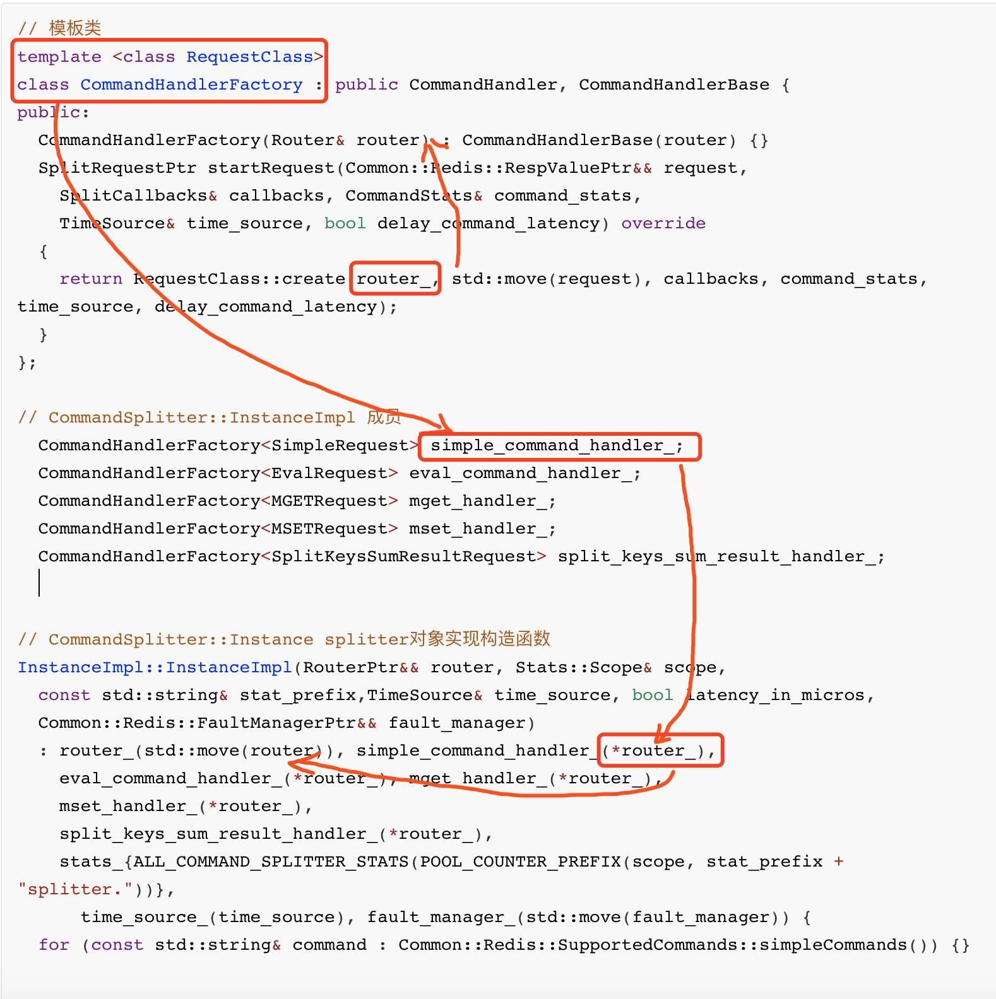
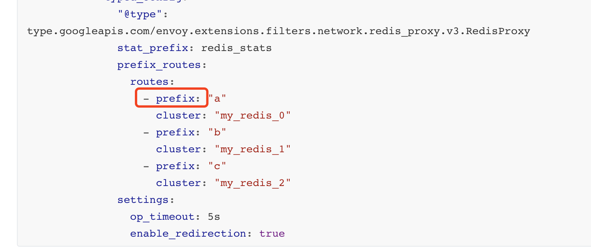
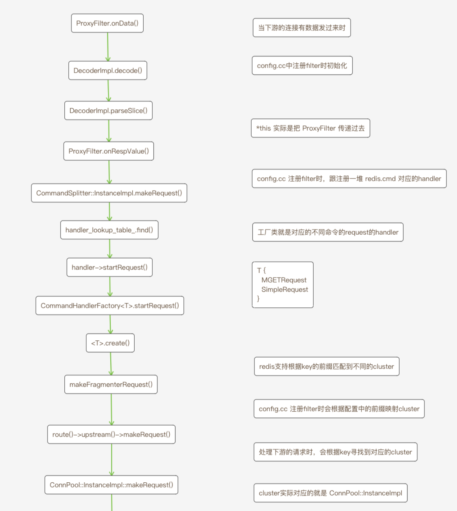

# `Envoy-Redis`源码分析 第6章

### 序

前面介绍了`cluster`相关信息，但是我们一直耿耿在怀的`router`对象却丝毫未提，现在本文将详细描述此对象。


首先，我们回到[第四章](https://github.com/x-lambda/note/wiki/Envoy-Redis-%E6%BA%90%E7%A0%81%E5%88%86%E6%9E%90-%E7%AC%AC4%E7%AB%A0)看看`router`出现时的情形

```c++
// router 是参数中传进来的
SplitRequestPtr SimpleRequest::create(Router& router,
                                      Common::Redis::RespValuePtr&& incoming_request,
                                      SplitCallbacks& callbacks, CommandStats& command_stats,
                                      TimeSource& time_source, bool delay_command_latency) {
  std::unique_ptr<SimpleRequest> request_ptr{
      new SimpleRequest(callbacks, command_stats, time_source, delay_command_latency)};
  // 从 router 中拿到 route 对象
  const auto route = router.upstreamPool(incoming_request->asArray()[1].asString());
  // route 对象被一路传递下去...
  if (route) {
    Common::Redis::RespValueSharedPtr base_request = std::move(incoming_request);
    request_ptr->handle_ =
        makeSingleServerRequest(route, base_request->asArray()[0].asString(),
                                base_request->asArray()[1].asString(), base_request, *request_ptr);
  }

  if (!request_ptr->handle_) {
    command_stats.error_.inc();
    callbacks.onResponse(Common::Redis::Utility::makeError(Response::get().NoUpstreamHost));
    return nullptr;
  }

  return request_ptr;
}
```

希望你还记得当时曾说过，`handler`只是一层套娃，背后真正调用的还是`*Request.create()`。所以我们反向跟踪，由`*Request.create()`寻找`handler`。如图

我们当时是正向跟踪，现在反过来，发现这个`router`最开始是从`CommandSplitter::InstanceImpl`对象来的。那这个`CommandSplitter::InstanceImpl`又是从哪来的呢？

这就得从最初的`filter`说起，`redis filter: ProxyFilter`那四大金刚参数，其中有一个就是`CommandSplitter::InstanceImpl`对象。我们再看一遍代码

```c++
// 构建 splitter
	std::shared_ptr<CommandSplitter::Instance> splitter = 
    std::make_shared<CommandSplitter::InstanceImpl>(
    	std::move(router), 
    	context.scope(), 
    	filter_config->stat_prefix_, 
    	context.timeSource(),
    	proto_config.latency_in_micros(), 
    	std::move(fault_manager)
  	);
	
  return [splitter, filter_config](Network::FilterManager& filter_manager) -> void {
    Common::Redis::DecoderFactoryImpl factory;
    // 使用 splitter 构建 ProxyFilter
    filter_manager.addReadFilter(std::make_shared<ProxyFilter>(
      	factory, 
      	Common::Redis::EncoderPtr{new Common::Redis::EncoderImpl()}, 
      	*splitter,
      	filter_config
    	)
    );
  };
```

至此我们已经找到了`splitter`对象初始化的时候，我们继续看怎么初始化的这个对象

```c++
// /envoy/source/extensions/filters/network/redis_proxy/config.cc
Network::FilterFactoryCb RedisProxyFilterConfigFactory::createFilterFactoryFromProtoTyped(
    const envoy::extensions::filters::network::redis_proxy::v3::RedisProxy& proto_config,
    Server::Configuration::FactoryContext& context) {
  // ...
	envoy::extensions::filters::network::redis_proxy::v3::RedisProxy::PrefixRoutes prefix_routes(proto_config.prefix_routes());

  // ...
  absl::flat_hash_set<std::string> unique_clusters;
  for (auto& route : prefix_routes.routes()) {
    addUniqueClusters(unique_clusters, route);
  }
  addUniqueClusters(unique_clusters, prefix_routes.catch_all_route());

  Upstreams upstreams;
  for (auto& cluster : unique_clusters) {
    Stats::ScopePtr stats_scope =
        context.scope().createScope(fmt::format("cluster.{}.redis_cluster", cluster));
    auto conn_pool_ptr = std::make_shared<ConnPool::InstanceImpl>(
        cluster, context.clusterManager(), Common::Redis::Client::ClientFactoryImpl::instance_,
        context.threadLocal(), proto_config.settings(), context.api(), std::move(stats_scope),
        redis_command_stats, refresh_manager);
    conn_pool_ptr->init();
    upstreams.emplace(cluster, conn_pool_ptr);
  }

  auto router =
      std::make_unique<PrefixRoutes>(prefix_routes, std::move(upstreams), context.runtime());

  auto fault_manager = std::make_unique<Common::Redis::FaultManagerImpl>(
      context.api().randomGenerator(), context.runtime(), proto_config.faults());

  std::shared_ptr<CommandSplitter::Instance> splitter =
      std::make_shared<CommandSplitter::InstanceImpl>(
          std::move(router), context.scope(), filter_config->stat_prefix_, context.timeSource(),
          proto_config.latency_in_micros(), std::move(fault_manager));
  return [splitter, filter_config](Network::FilterManager& filter_manager) -> void {
    Common::Redis::DecoderFactoryImpl factory;
    filter_manager.addReadFilter(std::make_shared<ProxyFilter>(
        factory, Common::Redis::EncoderPtr{new Common::Redis::EncoderImpl()}, *splitter,
        filter_config));
  };  
}
```

咋一看一脸懵逼，我们先挑部分代码出来，如下

```c++
// 1. Upstreams
Upstreams upstreams;
  for (auto& cluster : unique_clusters) {
    Stats::ScopePtr stats_scope =
        context.scope().createScope(fmt::format("cluster.{}.redis_cluster", cluster));
    // 2. ConnPool::InstanceImpl
    auto conn_pool_ptr = std::make_shared<ConnPool::InstanceImpl>(
        cluster, context.clusterManager(), Common::Redis::Client::ClientFactoryImpl::instance_,
        context.threadLocal(), proto_config.settings(), context.api(), std::move(stats_scope),
        redis_command_stats, refresh_manager);
    conn_pool_ptr->init();
    // ConnPool::InstanceImpl 构建 upstreams
    upstreams.emplace(cluster, conn_pool_ptr);
  }
	
	// 3. PrefixRoutes
	// upstreams 构建 PrefixRoutes
  auto router = std::make_unique<PrefixRoutes>(prefix_routes, std::move(upstreams), context.runtime());

// 4. CommandSplitter::Instance
std::shared_ptr<CommandSplitter::Instance> splitter =
      std::make_shared<CommandSplitter::InstanceImpl>(
          std::move(router), context.scope(), filter_config->stat_prefix_, context.timeSource(),
          proto_config.latency_in_micros(), std::move(fault_manager));
```

我们先不解释具体行为，对于重点对象我都标记出来了，直接记结论，`upstreams`是一个容器，里面存储的是`cluster_name`和对应的`ConnPool::InstanceImpl`对象，然后我们用这个容器去构建了另一个对象`PrefixRoutes`，再用`PrefixRoutes`构建`CommandSplitter::Instance splitter`，最后用`splitter`构建`ProxyFilter`。

至此，我们能回答第一个问题了，`router`从哪来，`router`就从这里来，他是一个`PrefixRoutes`对象。


在继续回答下一个问题之前，我们先看一段配置。

```yaml
static_resources:
  listeners:
    - name: redis_default
      address:
        socket_address: { address: 0.0.0.0, port_value: 8000 }
      filter_chains:
        - filters:
          - name: envoy.filters.network.redis_proxy
            typed_config:
              "@type": type.googleapis.com/envoy.extensions.filters.network.redis_proxy.v3.RedisProxy
              stat_prefix: redis_stats
              prefix_routes:
                routes:
                	- prefix: "a"
                	  cluster: "my_redis_0"
                	- prefix: "b"
                	  cluster: "my_redis_1"
                	- prefix: "c"
                	  cluster: "my_redis_2"
              settings:
                op_timeout: 5s
                enable_redirection: true
```

上面的配置含义是，在`8000`端口上起一个服务，负责代理`redis`请求。如果请求的`key`是以`a`开头，则将请求转发到`my_redis_0`集群上，如果是以`b`开头，则将请求转发到`my_redis_1`集群上，同理，以`c`开头的请求会被转发到`my_redis_2`集群上。

如果我希望所有的请求都转发到一个集群，则可以这样配置

```yaml
static_resources:
  listeners:
    - name: redis_default
      address:
        socket_address: { address: 0.0.0.0, port_value: 8000 }
      filter_chains:
        - filters:
          - name: envoy.filters.network.redis_proxy
            typed_config:
              "@type": type.googleapis.com/envoy.extensions.filters.network.redis_proxy.v3.RedisProxy
              stat_prefix: redis_stats
              prefix_routes:
                catch_all_route:
                  cluster: my_redis_cluster
              settings:
                op_timeout: 5s
                enable_redirection: true
```

理解了上面的配置，代码就不难理解，这里我同样直接说结论。每个`prefix`对应一个集群，`envoy`会为这个集群建立一个连接池，`upstreams`里面存的就是`prefix-ConnPool`键值对信息，`PrefixRoutes`也是一个套娃，封装了`upstreams`。

再列举一下刚刚遇到的对象

* `PrefixRoutes`
* `Upstreams`
* `ConnPool::InstanceImpl`

现在我们挨个战术分析。


##### `PrefixRoutes`

刚刚说过这个对象就是一个套娃，我们来看看这东西是怎么套的？

```c++
// /envoy/source/extensions/filters/network/redis_proxy/router_impl.cc
PrefixRoutes::PrefixRoutes(const envoy::extensions::filters::network::redis_proxy::v3::RedisProxy::PrefixRoutes& config,
    Upstreams&& upstreams, Runtime::Loader& runtime)
    : case_insensitive_(config.case_insensitive()), upstreams_(std::move(upstreams)),
      catch_all_route_(config.has_catch_all_route() ? std::make_shared<Prefix>(config.catch_all_route(), upstreams_, runtime) : nullptr) {

  // 配置中的router信息
  for (auto const& route : config.routes()) {
    std::string copy(route.prefix());

    // 判断大小写敏感
    if (case_insensitive_) {
      absl::AsciiStrToLower(&copy);
    }

    // 这里出现一个map<string, Prefix>
    // key: string 对应配置中的信息，例如最上面的 a/b/c
    // Prefix 是啥？
    auto success = prefix_lookup_table_.add(
        copy.c_str(), std::make_shared<Prefix>(route, upstreams_, runtime), false);
    if (!success) {
      throw EnvoyException(fmt::format("prefix `{}` already exists.", route.prefix()));
    }
  }
}

// 通过 key 寻找 Prefix 对象
RouteSharedPtr PrefixRoutes::upstreamPool(std::string& key) {
  PrefixSharedPtr value = nullptr;
  if (case_insensitive_) {
    std::string copy = absl::AsciiStrToLower(key);
    value = prefix_lookup_table_.findLongestPrefix(copy.c_str());
  } else {
    value = prefix_lookup_table_.findLongestPrefix(key.c_str());
  }

  if (value != nullptr) {
    if (value->removePrefix()) {
      key.erase(0, value->prefix().length());
    }
    return value;
  }

  return catch_all_route_;
}
```

一套代码看下来，我们发现这个套娃其实不复杂，就是一个`map`，里面包了一个`Prefix`对象，我想大家跟我一样，此刻的内心有一万头羊驼在奔腾。我们继续看

##### `Prefix`

```c++
class Prefix : public Route {
public:
  Prefix(const envoy::extensions::filters::network::redis_proxy::v3::RedisProxy::PrefixRoutes::Route
             route, Upstreams& upstreams, Runtime::Loader& runtime);
  ConnPool::InstanceSharedPtr upstream() const override { return upstream_; }
  const std::string& prefix() const { return prefix_; }
private:
  const std::string prefix_;
  const ConnPool::InstanceSharedPtr upstream_;
};

Prefix::Prefix(const envoy::extensions::filters::network::redis_proxy::v3::RedisProxy::PrefixRoutes::Route route,
               Upstreams& upstreams, Runtime::Loader& runtime)
  : prefix_(route.prefix()), 
    remove_prefix_(route.remove_prefix()),
		upstream_(upstreams.at(route.cluster())) {
  for (auto const& mirror_policy : route.request_mirror_policy()) {
    mirror_policies_.emplace_back(std::make_shared<MirrorPolicyImpl>(
        mirror_policy, upstreams.at(mirror_policy.cluster()), runtime));
  }
}
```

这一圈看完，真是好家伙，又™是一个套娃。`PrefixRoutes`包`Prefix`，`Prefix`包`Upstreams`....不过大家别急着吐槽，我们还是得看看这么做的意图是啥？

我们对比着配置看，不难想象，这里的`Prefix`对象就是配置中的`routes`下面的一个对象封装。所以`Prefix.prefix_`就对应着字符串配置，`Prefix.upstream_`对应着`cluster`信息。例如根据下面的配置，我们就能得到3个`Prefix`对象。



```c++
Prefix:{ prefix_: "a", upstream_: 对应my_redis_0的集群信息}
Prefix:{ prefix_: "b", upstream_: 对应my_redis_1的集群信息}
Prefix:{ prefix_: "c", upstream_: 对应my_redis_2的集群信息}
```

而`PrefixRoutes`还存在一个`map`，大致如下

```c++
PrefixRoutes{
  prefix_lookup_table_{
    "a": Prefix{prefix_: "a", upstream_: 对应my_redis_0的集群信息},
    "b": Prefix{prefix_: "b", upstream_: 对应my_redis_1的集群信息},
    "c": Prefix{prefix_: "c", upstream_: 对应my_redis_2的集群信息}, 
  }
}
```

`PrefixRoutes`说完轮到了`Upstreams`

##### `Upstreams`

```c++
// /envoy/source/extensions/filters/filters/network/redis_proxy/config.cc
inline void addUniqueClusters(
    absl::flat_hash_set<std::string>& clusters,
    const envoy::extensions::filters::network::redis_proxy::v3::RedisProxy::PrefixRoutes::Route&
        route) {
  clusters.emplace(route.cluster());
  for (auto& mirror : route.request_mirror_policy()) {
    clusters.emplace(mirror.cluster());
  }
}

// /envoy/source/extensions/filters/filters/network/redis_proxy/config.cc
// unique_clusters 其实就是一个字符串set
// 存储了配置中的每个cluster name，
// 按照上面的配置就是 <"my_redis_0", "my_redis_1", "my_redis_2">
absl::flat_hash_set<std::string> unique_clusters;
  for (auto& route : prefix_routes.routes()) {
    addUniqueClusters(unique_clusters, route);
  }
  addUniqueClusters(unique_clusters, prefix_routes.catch_all_route());

Upstreams upstreams;
  for (auto& cluster : unique_clusters) {
    Stats::ScopePtr stats_scope =
        context.scope().createScope(fmt::format("cluster.{}.redis_cluster", cluster));
    // 这里出现了ConnPool::InstanceImpl对象
    auto conn_pool_ptr = std::make_shared<ConnPool::InstanceImpl>(
        cluster, context.clusterManager(), Common::Redis::Client::ClientFactoryImpl::instance_,
        context.threadLocal(), proto_config.settings(), context.api(), std::move(stats_scope),
        redis_command_stats, refresh_manager);
    conn_pool_ptr->init();
    // TODO
    upstreams.emplace(cluster, conn_pool_ptr);
  }

// 可以看到这个Upstreams就是一个map
using Upstreams = std::map<std::string, ConnPool::InstanceSharedPtr>;
```

##### `ConnPool::InstanceImpl`

如同字面含义一样，这个对象就是一个连接池。

```c++
// /envoy/source/extensions/filters/network/redis_proxy/conn_pool_impl.h
class InstanceImpl : public Instance, public std::enable_shared_from_this<InstanceImpl> {
public:
  InstanceImpl(
      const std::string& cluster_name, Upstream::ClusterManager& cm,
      Common::Redis::Client::ClientFactory& client_factory, ThreadLocal::SlotAllocator& tls,
      const envoy::extensions::filters::network::redis_proxy::v3::RedisProxy::ConnPoolSettings&
          config,
      Api::Api& api, Stats::ScopePtr&& stats_scope,
      const Common::Redis::RedisCommandStatsSharedPtr& redis_command_stats,
      Extensions::Common::Redis::ClusterRefreshManagerSharedPtr refresh_manager);
  // RedisProxy::ConnPool::Instance
  Common::Redis::Client::PoolRequest* makeRequest(const std::string& key, RespVariant&& request,
                                                  PoolCallbacks& callbacks) override;
  /**
   * Makes a redis request based on IP address and TCP port of the upstream host (e.g.,
   * moved/ask cluster redirection). This is now only kept mostly for testing.
   * @param host_address supplies the IP address and TCP port of the upstream host to receive
   * the request.
   * @param request supplies the Redis request to make.
   * @param callbacks supplies the request completion callbacks.
   * @return PoolRequest* a handle to the active request or nullptr if the request could not be
   * made for some reason.
   */
  Common::Redis::Client::PoolRequest*
  makeRequestToHost(const std::string& host_address, const Common::Redis::RespValue& request,
                    Common::Redis::Client::ClientCallbacks& callbacks);

  void init();

  // Allow the unit test to have access to private members.
  friend class RedisConnPoolImplTest;

private:
  struct ThreadLocalPool;

  struct ThreadLocalActiveClient : public Network::ConnectionCallbacks {
    ThreadLocalActiveClient(ThreadLocalPool& parent) : parent_(parent) {}

    // Network::ConnectionCallbacks
    void onEvent(Network::ConnectionEvent event) override;
    void onAboveWriteBufferHighWatermark() override {}
    void onBelowWriteBufferLowWatermark() override {}

    ThreadLocalPool& parent_;
    Upstream::HostConstSharedPtr host_;
    Common::Redis::Client::ClientPtr redis_client_;
  };

  using ThreadLocalActiveClientPtr = std::unique_ptr<ThreadLocalActiveClient>;

  struct PendingRequest : public Common::Redis::Client::ClientCallbacks,
                          public Common::Redis::Client::PoolRequest {
    PendingRequest(ThreadLocalPool& parent, RespVariant&& incoming_request,
                   PoolCallbacks& pool_callbacks);
    ~PendingRequest() override;

    // Common::Redis::Client::ClientCallbacks
    void onResponse(Common::Redis::RespValuePtr&& response) override;
    void onFailure() override;
    bool onRedirection(Common::Redis::RespValuePtr&& value, const std::string& host_address,
                       bool ask_redirection) override;

    // PoolRequest
    void cancel() override;

    ThreadLocalPool& parent_;
    const RespVariant incoming_request_;
    Common::Redis::Client::PoolRequest* request_handler_;
    PoolCallbacks& pool_callbacks_;
  };

  struct ThreadLocalPool : public ThreadLocal::ThreadLocalObject,
                           public Upstream::ClusterUpdateCallbacks {
    ThreadLocalPool(std::shared_ptr<InstanceImpl> parent, Event::Dispatcher& dispatcher,
                    std::string cluster_name);
    ~ThreadLocalPool() override;
    ThreadLocalActiveClientPtr& threadLocalActiveClient(Upstream::HostConstSharedPtr host);
    Common::Redis::Client::PoolRequest* makeRequest(const std::string& key, RespVariant&& request,
                                                    PoolCallbacks& callbacks);
    Common::Redis::Client::PoolRequest*
    makeRequestToHost(const std::string& host_address, const Common::Redis::RespValue& request,
                      Common::Redis::Client::ClientCallbacks& callbacks);

    void onClusterAddOrUpdateNonVirtual(Upstream::ThreadLocalCluster& cluster);
    void onHostsAdded(const std::vector<Upstream::HostSharedPtr>& hosts_added);
    void onHostsRemoved(const std::vector<Upstream::HostSharedPtr>& hosts_removed);
    void drainClients();

    // Upstream::ClusterUpdateCallbacks
    void onClusterAddOrUpdate(Upstream::ThreadLocalCluster& cluster) override {
      onClusterAddOrUpdateNonVirtual(cluster);
    }
    void onClusterRemoval(const std::string& cluster_name) override;

    void onRequestCompleted();

    std::weak_ptr<InstanceImpl> parent_;
    Event::Dispatcher& dispatcher_;
    const std::string cluster_name_;
    Upstream::ClusterUpdateCallbacksHandlePtr cluster_update_handle_;
    Upstream::ThreadLocalCluster* cluster_{};
    absl::node_hash_map<Upstream::HostConstSharedPtr, ThreadLocalActiveClientPtr> client_map_;
    Envoy::Common::CallbackHandle* host_set_member_update_cb_handle_{};
    absl::node_hash_map<std::string, Upstream::HostConstSharedPtr> host_address_map_;
    std::string auth_username_;
    std::string auth_password_;
    std::list<Upstream::HostSharedPtr> created_via_redirect_hosts_;
    std::list<ThreadLocalActiveClientPtr> clients_to_drain_;
    std::list<PendingRequest> pending_requests_;

    /* This timer is used to poll the active clients in clients_to_drain_ to determine whether they
     * have been drained (have no active requests) or not. It is only enabled after a client has
     * been added to clients_to_drain_, and is only re-enabled as long as that list is not empty. A
     * timer is being used as opposed to using a callback to avoid adding a check of
     * clients_to_drain_ to the main data code path as this should only rarely be not empty.
     */
    Event::TimerPtr drain_timer_;
    bool is_redis_cluster_;
    Common::Redis::Client::ClientFactory& client_factory_;
    Common::Redis::Client::ConfigSharedPtr config_;
    Stats::ScopeSharedPtr stats_scope_;
    Common::Redis::RedisCommandStatsSharedPtr redis_command_stats_;
    RedisClusterStats redis_cluster_stats_;
    const Extensions::Common::Redis::ClusterRefreshManagerSharedPtr refresh_manager_;
  };

  const std::string cluster_name_;
  Upstream::ClusterManager& cm_;
  Common::Redis::Client::ClientFactory& client_factory_;
  ThreadLocal::SlotPtr tls_;
  Common::Redis::Client::ConfigSharedPtr config_;
  Api::Api& api_;
  Stats::ScopeSharedPtr stats_scope_;
  Common::Redis::RedisCommandStatsSharedPtr redis_command_stats_;
  RedisClusterStats redis_cluster_stats_;
  const Extensions::Common::Redis::ClusterRefreshManagerSharedPtr refresh_manager_;
};

```

从上面的代码可以看出来这个对象是多么复杂，不过这里不会展开细讲，尤其是里面的线程模型。读者也不用担心，在整个`Envoy-Redis`源码中，线程的事可以暂时放一边，不影响整体的理解。

好了，至此我们把`router`一路上遇到的对象都找到了，现在我们再回到第4章的末尾。

```c++
// /envoy/source/extensions/filters/network/redis_proxy/command_splitter_impl.cc
// upstreamPool()方法我们前面看到了，就是根据redis request的key去查找upstream
// route是Prefix对象，里面包了upstream的
const auto route = router.upstreamPool(incoming_request->asArray()[1].asString());

// route->upstream()
// 实际是调
// ConnPool::InstanceSharedPtr Prefix::upstream() const override { return upstream_; }
auto handler = route->upstream()->makeRequest(key, ConnPool::RespVariant(incoming_request), callbacks);
```

所以我们知道这里的`makeRequest()`就是`ConnPool::InstanceImpl::makeRequest()`调用。


总结：

在第4章匆匆收尾，是因为我们遇到了一个陌生的`router`对象，我们不得不中断现有的跟踪流程。在清楚解释了`router`得来源之后，我们再回归到原有的节奏中，用一张图来展现我们已经走过的历程。
不过显然我们连一半的路程都没走完。


