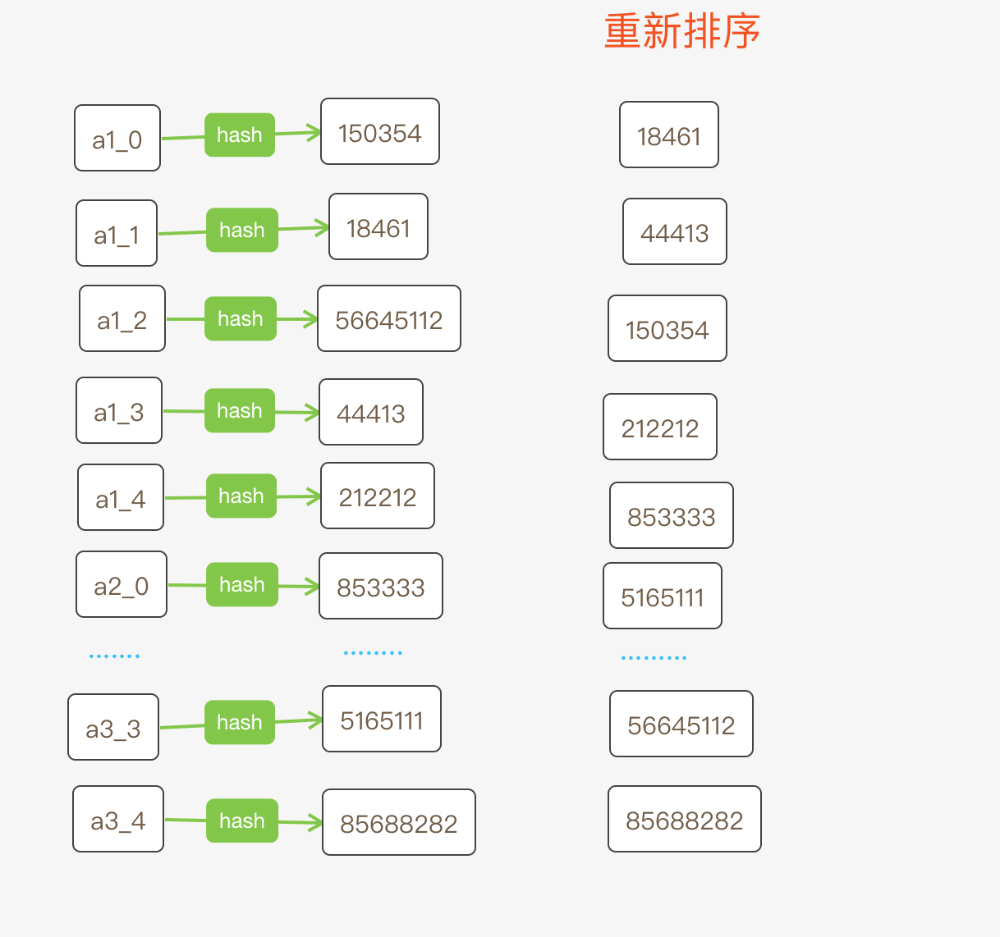

# `Envoy-Redis`源码分析 第8章

### 序

一致性哈希：https://zh.wikipedia.org/wiki/%E4%B8%80%E8%87%B4%E5%93%88%E5%B8%8C


作为`Redis/Memcached proxy`，一致性哈希是避不开的话题。`Envoy`将一致性哈希算法封装在`LoadBalancer`中，今天我们就来看看具体的实现。


##### `Load Balance`配置

`load balance`：负载均衡，是指将下游的请求转发给上游时选择的算法。

例如：有一个`HTTP`服务，总共有`300`个实例，假如`envoy`使用`ROUND_ROBIN`算法分配请求，如果所有请求耗时差不多，则后面的机器实例，负载就会比较均衡。这种情况是请求和处理实例没有耦合关系时常见的方式，如果像`Memcached/Redis`这样的后端，则需求根据请求的`key`，做一次`hash`计算，然后映射到具体的实例。


在`envoy`中`load balance`与`cluster`可以绑定到一起的，也可以是解耦的。例如，`redis`集群如果是以集群的方式部署，则常见的`lb`算法`ROUND_ROBIN/RING_HASH/MAGLEV`这些不再适用，因此`envoy-redis`也自己实现了一套`LB`。

具体配置如下

```yaml

clusters:
    - name: xxxxx
      connect_timeout: 0.25s
      lb_policy: CLUSTER_PROVIDED
      cluster_type:
        name: envoy.clusters.redis  
        typed_config:
          "@type": type.googleapis.com/google.protobuf.Struct
          value:
            cluster_refresh_rate: 60s
            ...
```

在上面的配置中指定了上游的`cluster_type`和`lb_policy`。

当指定了`cluster_type`参数，表明上游`redis`集群是以集群的方式部署，如果指定另一个参数`type:static`，表示上游`redis`集群是单独的进程，只当做缓存集群。这两个参数是冲突的，不能同时指定。

再看另一个配置`lb_policy`，这个就是负载均衡的配置，`CLUSTER_PROVIDED`表示`envoy-redis`自己实现了一套`LB`策略。这个配置还可以选择其他算法。例如

```yaml
lb_policy: ROUND_ROBIN
# lb_policy: RING_HASH
# lb_policy: MAGLEV
```

`envoy`实现了几套常用的`hash`算法，文档：[https://www.envoyproxy.io/docs/envoy/v1.16.0/intro/arch_overview/upstream/load_balancing/load_balancing.html?highlight=load%20balance](https://www.envoyproxy.io/docs/envoy/v1.16.0/intro/arch_overview/upstream/load_balancing/load_balancing.html?highlight=load balance)


##### `ring hash`算法

我们都知道一致性`hash`是为了减少在系统<b>扩容/缩容</b>带来的缓存失效。目前有很多种方案，我们看最常用的一种。

1. 构造一个长度为N的数组
2. 将所有服务节点通过`hash`[1]计算得到的正整数，同时将自身的的数据`(ip/port)`存放在数组里
3. 完成计算后重新按从小到大排序
4. 客户端获取路由节点时，根据某种`hash`[2]计算得到另一个值`hashcode`
5. 遍历数组找到第一个比`hashcode`小的元素，然后取其`ip/port`

注意这里的`hash`[1]和`hash`[2]算法可能不一样。

我们可以参考下图

假如我们有3台机器，`hostname`分别是`a1,a2,a3`。这时我们可以给每个`hostname`之后加一个"_%d"，这样相当于从逻辑上增加了机器实例。

如果每台机器被放大5倍，产生5个新的`hostname`，然后对每个`hostname`做一次`hash`运算，得到一个数值，将所有的数值放到一个数组中，并排序，这样就得到一个有序数组。

现在当客户端发送一个`set/get`命令，我们把命令中的`key`做一次`hash`计算也得到一个值，然后根据这个值到数组中查找比它小的，且最近的那个数值，如果找不到，则选择下标为0的元素。

例如`key:a`计算得到 `344092`，这时可以找到比它小，且距离它最近的那个值是`212212`，这个值是由`a1_4`计算出来的，所以`key:a`对应的续写请求都会转发给`a1_4`这个机器，也就是`a1`。

##### `Envoy Ring Hash`实现

生成数组的过程

```c++
// /envoy/source/common/upstream/ring_hash_lb.cc
using HashFunction = envoy::config::cluster::v3::Cluster::RingHashLbConfig::HashFunction;
RingHashLoadBalancer::Ring::Ring(const NormalizedHostWeightVector& normalized_host_weights,
                                 double min_normalized_weight, uint64_t min_ring_size,
                                 uint64_t max_ring_size, HashFunction hash_function,
                                 bool use_hostname_for_hashing, RingHashLoadBalancerStats& stats)
    : stats_(stats) {
  /**
    * 参数 normalized_host_weights
    * 由配置中的host得到，不同的区域不同的节点可以设置不同的优先级，参考 https://www.envoyproxy.io/docs/envoy/latest/intro/arch_overview/upstream/load_balancing/priority
    */      
  ENVOY_LOG(trace, "ring hash: building ring");

  // We can't do anything sensible with no hosts.
  if (normalized_host_weights.empty()) {
    return;
  }

  // 前面我们说过为了让key分布均匀，每台机器都会在逻辑上扩大N倍，这里就是根据权重计算要扩大的倍数
  // Scale up the number of hashes per host such that the least-weighted host gets a whole number
  // of hashes on the ring. Other hosts might not end up with whole numbers, and that's fine (the
  // ring-building algorithm below can handle this). This preserves the original implementation's
  // behavior: when weights aren't provided, all hosts should get an equal number of hashes. In
  // the case where this number exceeds the max_ring_size, it's scaled back down to fit.
  const double scale =
      std::min(std::ceil(min_normalized_weight * min_ring_size) / min_normalized_weight,
               static_cast<double>(max_ring_size));

  // Reserve memory for the entire ring up front.
  const uint64_t ring_size = std::ceil(scale);
  ring_.reserve(ring_size);

  // Populate the hash ring by walking through the (host, weight) pairs in
  // normalized_host_weights, and generating (scale * weight) hashes for each host. Since these
  // aren't necessarily whole numbers, we maintain running sums -- current_hashes and
  // target_hashes -- which allows us to populate the ring in a mostly stable way.
  //
  // For example, suppose we have 4 hosts, each with a normalized weight of 0.25, and a scale of
  // 6.0 (because the max_ring_size is 6). That means we want to generate 1.5 hashes per host.
  // We start the outer loop with current_hashes = 0 and target_hashes = 0.
  //   - For the first host, we set target_hashes = 1.5. After one run of the inner loop,
  //     current_hashes = 1. After another run, current_hashes = 2, so the inner loop ends.
  //   - For the second host, target_hashes becomes 3.0, and current_hashes is 2 from before.
  //     After only one run of the inner loop, current_hashes = 3, so the inner loop ends.
  //   - Likewise, the third host gets two hashes, and the fourth host gets one hash.
  //
  // For stats reporting, keep track of the minimum and maximum actual number of hashes per host.
  // Users should hopefully pay attention to these numbers and alert if min_hashes_per_host is too
  // low, since that implies an inaccurate request distribution.

  absl::InlinedVector<char, 196> hash_key_buffer;
  double current_hashes = 0.0;
  double target_hashes = 0.0;
  uint64_t min_hashes_per_host = ring_size;
  uint64_t max_hashes_per_host = 0;
  for (const auto& entry : normalized_host_weights) {
    const auto& host = entry.first;
    // 如果配置中指定了use_hostname_for_hashing参数，则根据每个机器的hostname计算，否则根据address计算
    const std::string& address_string =
        use_hostname_for_hashing ? host->hostname() : host->address()->asString();
    ASSERT(!address_string.empty());

    hash_key_buffer.assign(address_string.begin(), address_string.end());
    // 要计算的字符串 key 后面加 _ 字符
    hash_key_buffer.emplace_back('_');
    auto offset_start = hash_key_buffer.end();

    // As noted above: maintain current_hashes and target_hashes as running sums across the entire
    // host set. `i` is needed only to construct the hash key, and tally min/max hashes per host.
    target_hashes += scale * entry.second;
    uint64_t i = 0;
    // 根据要扩大的N倍，计算N个值
    while (current_hashes < target_hashes) {
      const std::string i_str = absl::StrCat("", i);
      hash_key_buffer.insert(offset_start, i_str.begin(), i_str.end());

      absl::string_view hash_key(static_cast<char*>(hash_key_buffer.data()),
                                 hash_key_buffer.size());

      // 配置中指定的 hash 方式
      const uint64_t hash =
          (hash_function == HashFunction::Cluster_RingHashLbConfig_HashFunction_MURMUR_HASH_2)
              ? MurmurHash::murmurHash2(hash_key, MurmurHash::STD_HASH_SEED)
              : HashUtil::xxHash64(hash_key);

      ENVOY_LOG(trace, "ring hash: hash_key={} hash={}", hash_key.data(), hash);
      // 计算好之后都加入 ring 数组中
      ring_.push_back({hash, host});
      ++i;
      ++current_hashes;
      hash_key_buffer.erase(offset_start, hash_key_buffer.end());
    }
    min_hashes_per_host = std::min(i, min_hashes_per_host);
    max_hashes_per_host = std::max(i, max_hashes_per_host);
  }

  // 对数组排序
  std::sort(ring_.begin(), ring_.end(), [](const RingEntry& lhs, const RingEntry& rhs) -> bool {
    return lhs.hash_ < rhs.hash_;
  });
  if (ENVOY_LOG_CHECK_LEVEL(trace)) {
    for (const auto& entry : ring_) {
      ENVOY_LOG(trace, "ring hash: host={} hash={}",
                use_hostname_for_hashing ? entry.host_->hostname()
                                         : entry.host_->address()->asString(),
                entry.hash_);
    }
  }

  stats_.size_.set(ring_size);
  stats_.min_hashes_per_host_.set(min_hashes_per_host);
  stats_.max_hashes_per_host_.set(max_hashes_per_host);
}
```

选择数组的过程

```c++
// /envoy/source/common/upstream/ring_hash_lb.cc
HostConstSharedPtr RingHashLoadBalancer::Ring::chooseHost(uint64_t h, uint32_t attempt) const {
  if (ring_.empty()) {
    return nullptr;
  }

  // Ported from https://github.com/RJ/ketama/blob/master/libketama/ketama.c (ketama_get_server)
  // I've generally kept the variable names to make the code easier to compare.
  // NOTE: The algorithm depends on using signed integers for lowp, midp, and highp. Do not
  //       change them!
  int64_t lowp = 0;
  int64_t highp = ring_.size();
  int64_t midp = 0;
  while (true) {
    // 二分查找
    midp = (lowp + highp) / 2;

    if (midp == static_cast<int64_t>(ring_.size())) {
      midp = 0;
      break;
    }

    uint64_t midval = ring_[midp].hash_;
    uint64_t midval1 = midp == 0 ? 0 : ring_[midp - 1].hash_;

    // 找到第一个比 h 小的元素
    // 这个h就是我们根据 redis request 中的key计算出来的
    if (h <= midval && h > midval1) {
      break;
    }

    if (midval < h) {
      lowp = midp + 1;
    } else {
      highp = midp - 1;
    }

    if (lowp > highp) {
      midp = 0;
      break;
    }
  }

  // If a retry host predicate is being applied, behave as if this host was not in the ring.
  // Note that this does not guarantee a different host: e.g., attempt == ring_.size() or
  // when the offset causes us to select the same host at another location in the ring.
  if (attempt > 0) {
    midp = (midp + attempt) % ring_.size();
  }

  return ring_[midp].host_;
}
```

最后我们看看对`redis request`中`key`计算的过程

```c++
// /envoy/source/extensions/filters/network/redis_proxy/conn_pool_impl.cc
Common::Redis::Client::PoolRequest*
InstanceImpl::ThreadLocalPool::makeRequest(const std::string& key, RespVariant&& request,
                                           PoolCallbacks& callbacks) {
  if (cluster_ == nullptr) {
    ASSERT(client_map_.empty());
    ASSERT(host_set_member_update_cb_handle_ == nullptr);
    return nullptr;
  }

  Clusters::Redis::RedisLoadBalancerContextImpl lb_context(key, 
    config_->enableHashtagging(), is_redis_cluster_, getRequest(request), 
    config_->readPolicy());
  
  // 这里的调用链有些复杂，涉及到线程
  // 不展开
  Upstream::HostConstSharedPtr host = cluster_->loadBalancer().chooseHost(&lb_context);
	// ...
}
```

我们再看看这`context`是啥

```c++
// /envoy/source/extensions/clusters/redis/redis_cluster_lb.cc
RedisLoadBalancerContextImpl::RedisLoadBalancerContextImpl(
    const std::string& key, bool enabled_hashtagging, bool is_redis_cluster,
    const NetworkFilters::Common::Redis::RespValue& request,
    NetworkFilters::Common::Redis::Client::ReadPolicy read_policy)
    // hashtag: 如果开启这个配置，会检测redis request中的key是不是包含{}
  	// 如果包含{}，则只对{}中的字符串做hash计算
  	// 例如 abc{def}123 ---> 开启这个配置之后，相当于hash_func(def)
    : hash_key_(is_redis_cluster ? Crc16::crc16(hashtag(key, true))
                                 : MurmurHash::murmurHash2(hashtag(key, enabled_hashtagging))),
      is_read_(isReadRequest(request)), read_policy_(read_policy) {}


// /envoy/source/extensions/clusters/redis/crc16.cc
// 在非cluster模式部署redis时，其实调用的就是 crc16 算法
uint16_t Crc16::crc16(absl::string_view key) {
  const char* buf = static_cast<const char*>(key.data());
  uint64_t len = key.size();
  uint64_t counter;
  uint16_t crc = 0;
  for (counter = 0; counter < len; counter++) {
    crc = (crc << 8) ^ crc16tab[((crc >> 8) ^ *buf++) & 0x00FF];
  }
  return crc;
}
```

注意本文是基于非`redis-cluster`模式下负载均衡的策略。


推荐阅读：

* [Envoy源码分析之Load balancing基础](https://developer.aliyun.com/article/757466)
* [Envoy源码分析之ThreadLocal机制](https://developer.aliyun.com/article/757471)

