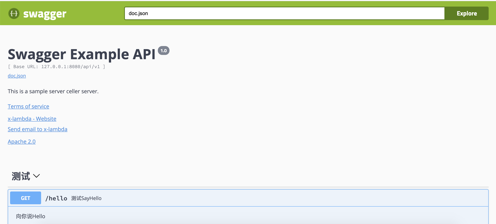
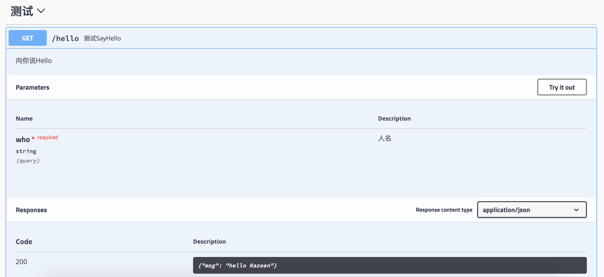

# go swagger使用

* 下载`swagger`，记得加到`$PATH`路径中
```shell
$ go get-u github.com/swaggo/swag/cmd/swag
```

* 创建`demo`项目
```shell
swagger-demo/
    |-main.go
```

* 编写`golang`代码
```go
package main

import (
	"net/http"

	"github.com/gin-gonic/gin"
	_ "golang-swagger-demo/docs"

	ginSwagger "github.com/swaggo/gin-swagger"
	"github.com/swaggo/gin-swagger/swaggerFiles"
)

// @title Swagger Example API
// @version 1.0
// @description This is a sample server celler server.
// @termsOfService https://www.xxxxx.com
// @contact.name x-lambda
// @contact.url https://github.com/x-lambda
// @contact.email ilib0x00000000@aliyun.com
// @license.name Apache 2.0
// @license.url http://www.apache.org/licenses/LICENSE-2.0.html
// @host 127.0.0.1:8080
// @BasePath /api/v1
func main() {
	r := gin.Default()
	r.GET("/swagger/*any", ginSwagger.WrapHandler(swaggerFiles.Handler))
	v1 := r.Group("/api/v1")
	{
		v1.GET("/hello", HandleHello)
		// v1.POST("/login", HandleLogin)
		// v1Auth := r.Use(HandleAuth)
		// {
		//     v1Auth.POST("/upload", HandleUpload)
		//     v1Auth.GET("/list", HandleList)
		// }
	}
	r.Run("127.0.0.1:8080")
}

// @Summary 测试SayHello
// @Description 向你说Hello
// @Tags 测试
// @Accept json
// @Param who query string true "人名"
// @Success 200 {string} string "{"msg": "hello Razeen"}"
// @Failure 400 {string} string "{"msg": "who are you"}"
// @Router /hello [get]
func HandleHello(c *gin.Context) {
	who := c.Query("who")
	if who == "" {
		c.JSON(http.StatusBadRequest, gin.H{"msg": "who are u?"})
		return
	}
	c.JSON(http.StatusOK, gin.H{"msg": "hello " + who})
}
```
注意：这里的代码是会报错的，先无视

* 生成`doc`
```shell
$ swag init
```
可以看见此时项目的目录结构如下
```shell
swagger-demo/
    |-docs/
        |-docs.go
        |-swagger.json
        |-swagger.yaml
    |-main.go
```

* 编译运行
```shell
$ go run main.go
```
注意： 在第4步之前代码都会提示导包错误，是因为引入的doc包依赖swag生成的文件，只有在第4步执行命令之后才会生成，然后编译通过

* 查看doc
http://127.0.0.1:8080/swagger/index.html#/


