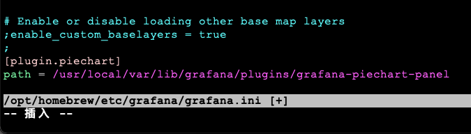
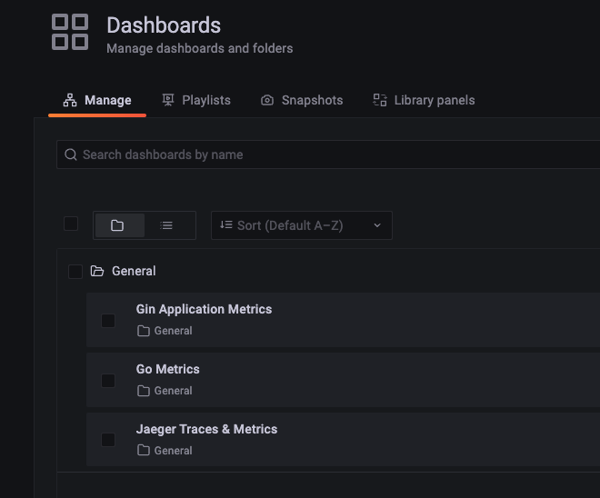

# Metrics

1.0 `Mac`安装`prometheus`
```shell
# 2.36.1
brew install prometheus
```

1.1 启动`prometheus`
```shell
brew services start prometheus
```

1.2 检查`prometheus`是否正常启动运行
```shell
curl http://127.0.0.1:9090/graph
```

1.3 修改`prometheus`配置
```shell
vim /opt/homebrew/etc/prometheus.yml
```

2.0 `Mac`安装`grafana`
```shell
brew install grafana
```

2.1 启动`grafana`
```shell
brew services start grafana
```

2.2 检查`grafana`是否正常启动运行
```shell
curl http://127.0.0.1:3000/
```

2.3 安装饼图插件
```shell
sudo grafana-cli plugins install grafana-piechart-panel
```
安装之后，插件地址默认是: `/usr/local/var/lib/grafana/plugins/grafana-piechart-panel`

不同版本或者系统可能不一样

2.4 配置`grafana`支持饼图
```shell
vim /opt/homebrew/etc/grafana/grafana.ini

# 在配置的最后面添加
[plugin.piechart]
path = /usr/local/var/lib/grafana/plugins/grafana-piechart-panel
```


2.5 重启`grafana`
```shell
brew services restart grafana
```


3.0 配置`prometheus`
/opt/homebrew/etc/prometheus.yml

4.0 配置`grafana`
### TODO


https://cloud.tencent.com/developer/article/1812416
https://027580.xyz/2022/03/02/7.html
